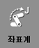
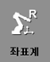
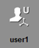

# 2.7.4 사용자 좌표계

| 축 좌표계 | 로봇 좌표계 | **사용자 좌표계** | 툴 좌표계 |
| :---: | :---: | :---: | :---: |
|    |   |   |   |

1.	초기 화면 우측의 \[설정\] 버튼 &gt; \[2: 제어 파라미터 &gt; 7: 좌표계 등록 &gt; 1: 사용자 좌표계\] 메뉴를 터치한 후 사용자 좌표계를 등록하십시오.


사용자 좌표계 등록 방법에 대한 자세한 내용은 “7.3.6.1 사용자 좌표계”를 참조하십시오.


2.	초기 화면 좌측 상단의 \[속도조절\] 버튼을 터치한 후 \[9: 사용자 좌표계 지정\] 옵션에 좌표계를 설정하십시오. 직교 좌표계 대신 사용자 좌표계를 선택할 수 있습니다.

3.	조그키로 로봇을 동작하십시오. 로봇이 다음과 같이 움직입니다.


조그키에 대한 로봇의 진행 방향에 대한 자세한 내용은 “2.7.1 조그키”를 참조하십시오.


