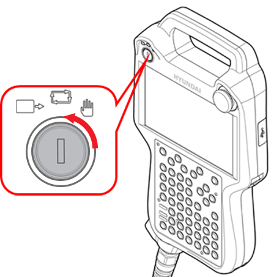
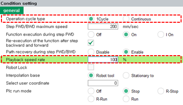

# 2.2.1 操作方法

教机器人工作内容并让其执行工作的方式如下。

1. 检查安全围栏内及机器人操作范围内是否有人员或障碍物。

2. 通过转动教导挂件的模式开关，将操作模式设置为自动模式。

    
  

     
     
    

3. 在 ${cont_model} 教导挂件屏幕的状态栏上，检查操作模式是否设置为自动模式。

    

* 如果设置为手动模式，请转动教导挂件的模式开关，将操作模式设置为自动模式。

4. 点击初始屏幕左侧的 `[Recording Condition]` 按钮。然后，将出现条件设置窗口。

    

5. 设置程序重复选项和机器人操作速度。

    

* `1: Operation Cycle type`: 您可以设置是否重复在自动操作期间将要执行的程序。
* `6: 自动运行速率 (6: Playback speed rate)`: 您可以设置程序在自动模式下回放时机器人的操作速度 \(%\)。  
  例如，如果设置操作速度为100，机器人将在记录的步骤速度下移动；如果设置为50，机器人将以记录速度的50%比例移动。

6. 按下教导挂件上的 `[start]` 键。启动灯会亮起，机器人将根据创建的程序执行工作。