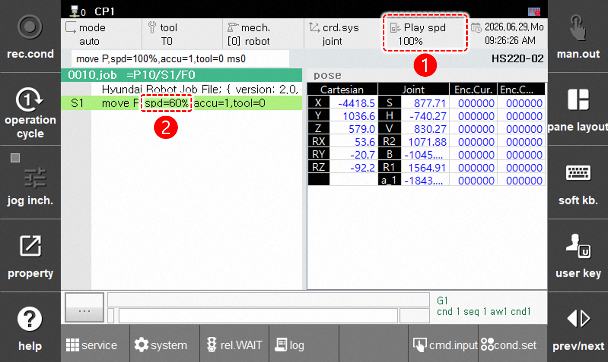
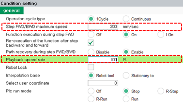

# 2.2.2 Operation Speed Adjustment

During automatic operation, the robot's playback speed \(%\) during program playback is displayed in the status bar at the top of the ${cont_model} teach pendant screen. The displayed playback speed represents the ratio of the robot's actual moving speed relative to the step speed recorded in the step.

| No. | Item | Mode | Description |
|-----|-----|-----|-----|
| ① | Playback Speed | Auto | Ratio of the robot's moving speed to the step speed (1 - 100) |
| ② | Step Speed | Auto/Manual | Commanded speed of the corresponding step (Unit: mm/sec, cm/min, %, sec) |
| ③ | Moving Speed | Auto/Manual | Playback Speed (%) * Step Speed |

The playback speed can be adjusted using the following methods:

1. In Auto Mode, adjust the playback speed by pressing the `[CTRL]`+`[SPEED.HI]` or `[CTRL]`+`[SPEED.LOW]` keys.  
If the playback speed is less than 10, it increases or decreases in increments of 1.  
If the playback speed is 10 or higher, it increases or decreases in increments of 10.

2. In Auto Mode, tapping the playback speed display area will bring up a speed adjustment pop-up dialog.  
You can enter a value from 1 to 100 or use the slider bar to adjust the value in minimum increments of 1%.  
Pressing the confirmation button in the dialog applies the entered value as the new playback speed.


[CAUTION] The operational specifications for applying real-time playback speed adjustments during motion are as follows:
* Generally, if the playback speed is adjusted during a motion operation, it is applied to the current motion in real time.
* However, in SAFETY MODE, the changed playback speed is applied from the next step after the current motion ends.
* Additionally, when the Arc function is activated, real-time playback speed changes during motion are not applied.
* Changing the playback speed drastically between extreme values (e.g., 1 -> 100 or 100 -> 1) is not recommended.



[ATTENTION] Les spécifications opérationnelles relatives à l’application des réglages de vitesse d’exécution en temps réel pendant le mouvement sont les suivantes :
* En règle générale, lorsqu’une vitesse d’exécution est modifiée pendant une opération de mouvement, la modification est appliquée en temps réel au mouvement en cours.
* Toutefois, en SAFETY MODE, la vitesse d’exécution modifiée est appliquée à partir de l’étape suivante, après la fin du mouvement en cours.
* De plus, lorsque la fonction Arc est activée, les modifications de vitesse d’exécution en temps réel pendant le mouvement ne sont pas appliquées.
* Il est déconseillé de modifier brusquement la vitesse d’exécution entre des valeurs extrêmes, par exemple de 1 à 100 ou de 100 à 1.



In manual mode, the `[Speed Adjustment]` button will display the step speed limit, instead of the playback speed \(%\).


In automatic mode, you can adjust the operation speed of the robot, without modifying the program, by changing the value of the automatic operation speed ratio in the condition setting. 

Tap the `cond.set` button at the bottom right of the ${cont_model} teach pendant screen, and then configure the values for options [Max Speed during Step Fwd/Bwd] and [Auto Operation Speed Ratio] in the settings window

