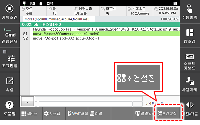

# 2.2.2 운전 속도 조정

자동 운전 시에는 Hi6 티치 펜던트 화면 상단의 상태표시막대에 프로그램 재생 시 로봇의 운전 속도\(%\)가 표시됩니다. 표시된 운전 속도는 스텝에 기록되어 있는 속도에 대한 로봇의 이동 속도의 비율입니다.


수동 모드일 때, **\[속도조절\]** 버튼에는 재생 속도\(%\) 대신 스텝 제한 속도\(㎜/sec\)가 표시됩니다.


자동 모드에서는 조건 설정의 자동 운전 속도 비율 값을 변경하여 프로그램을 수정하지 않고 로봇의 운전 속도를 조절할 수 있습니다.

Hi6 티치 펜던트 화면 우하단에서 **\[조건설정\]** 버튼을 터치한 후 설정창에서 \[2: 스텝 전후진시 최고속\] 과 \[6: 자동운전 속도비율\] 옵션의 값을 설정하십시오.

 좌측의 **\[속도조절\]** 버튼을 터치한 후 설정창에서 \[2: 스텝 전후진시 최고속\] 과 \[6: 자동운전 속도비율\] 옵션의 값을 설정하십시오.

