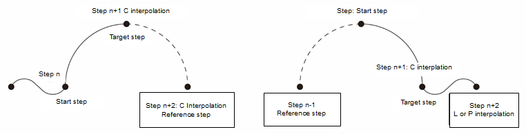
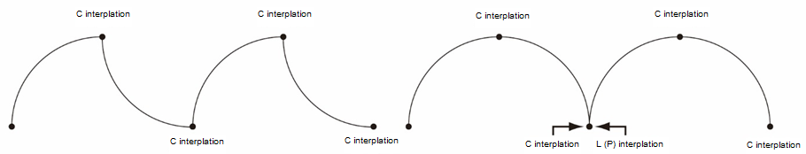

# 2.3.1.1 插值

插值是指步骤之间的插值路径，而 `[Step N]` 的插值方法决定了 `[Step N-1]` 和 `[Step N]` 之间的路径形式。

* P-PTP \(点对点\) 它是一般插值模式中最快的，因为它基于单独的轴，而不是工具末端插值两个步骤之间的路径。考虑到由旋转关节组成的工业机器人特性，工具末端的路径通常呈 C 形。

* L-线性插值 它在笛卡尔空间中的两个步骤之间沿直线移动。它用于需要线性路径的情况，例如弧焊部分。运动会在手腕姿态自动变化的情况下进行，如下所示。

在线性插值期间，在某些条件下，机器人无法自动改变手腕姿态，这种情况称为奇异姿态。


无法执行姿态插值的奇异姿态如下。

* 如果 B 轴接近死区：有关死区设置的详细信息，请参考 "[7.4.5 B 轴死区](../../../7-system/4-robot-parameter/5-b-axis-deadzone.md)"。
* 当 B 轴的符号改变时：当 B 轴角度的符号切换 \( - → + \) 或 \( + → - \)
* 当 R2 和 R1 轴的角度变化超过 180 度
* 当 B 轴 \(轴 5\) 或工具末端通过 S 轴 \(轴 1\) 的旋转中心时：在姿态和轨迹中可能会出现错误。
* 当 S 轴的角度变化超过 180 度


* C-圆形插值

  它在两个步骤之间创建的圆形路径中移动。确定圆形需要三个点，选择这些点的参考如下。

  * 在从 `[Step n]` 移动到 `[Step n+1]` 时，如果 `[Step n+1]` 的插值方法是 C-圆形插值，则需要参考下一个步骤 `[Step n+2]`。

  * 如果 `[Step n+2]` 的插值方法是 C-圆形插值，则需要基于 `[Step n]`、`[Step n+1]` 和 `[Step n+2]` 确定圆形，并在其中沿 `[Step n]` - `[Step n+1]` 的段的弧线移动。

  * 如果 `[Step n+2]` 的插值方法不是圆形插值，则需要参考前一步骤 `[Step n-1]` 并基于 `[Step n-1]`、`[Step n]` 和 `[Step n+1]` 确定圆形，并在其中沿 `[Step n]` - `[Step n+1]` 的段的弧线移动。

如果使用选择确定圆形所需的三个点的标准，您可以通过对相同点进行双重注册来创建程序，即使在连续弧的情况下也是如此。

通过确定步骤的插值方法以考虑沿移动路径，并使用相同点的双重注册功能，您可以按需创建程序。

* 固定工具插值

  当机器人拥有工件并使用外部固定工具进行工作时，将使用此方法。在这种情况下，插值将在机器人拥有的工件基础上进行。

  有关固定工具的插值类型的详细信息，请参考 "[7.3.6.2 固定工具坐标系统](../../../7-system/3-control-parameter/6-cordsys-reg/2-stationary-tool-crdsys.md)"。