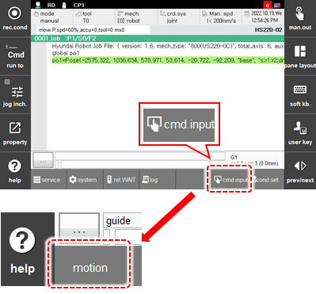
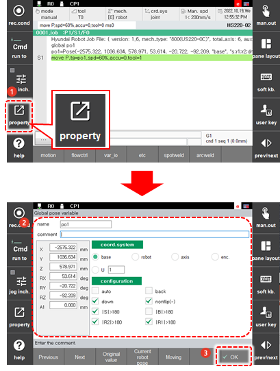

# 2.3.1.2 Pose

A pose is a parameter to record the position. If you input a move, the movement command, by using the \[Command\] button, you should designate the pose expression in the tg \(target\) parameter. When the move statement is inputted using the <<b>REC</b>> key, the tg parameter will not appear. At the moment of touching the <<b>REC</b>> key, the position and posture of the manipulator will be recorded, but they will not be displayed on the JOB editing screen, which is why they are called a hidden pose.

The method to input a pose is as follows.

1. Declare a pose variable, po1.
   select [cmd.input > var_io > global or var] menu, and then input 'po1'.
2. Initialize the pose variable as a pose type, using [**cur.pose**] button.
3. Execute the declare and initialization commands so that periods are marked at the front of each command.
4. After touching the \[cmd.input\] button, select \[motion\] and then input the statement.

    

5. After touching the \[property\] button, set the attributes of the current robot pose and then touch the \[Apply\] button.

    

 

The pose variable and shift variable will be saved in the following formats.

<table>
  <thead>
    <tr>
      <th style="text-align:center">Pose Variable</th>
      <th style="text-align:center">Shift Variable</th>
    </tr>
  </thead>
  <tbody>
    <tr>
      <td style="text-align:center">(X, Y, Z, Rx, Ry, Rz, {Coordinate system}, {config.})</td>
      <td style="text-align:center">(X, Y, Z, Rx, Ry, Rz, {Coordinate system})</td>
    </tr>
    <tr>
      <td style="text-align:center">
        
{Coordinate system}:

        
&quot;base&quot; = Base coordinate system
           &quot;robot&quot; = Robot coordinate system
           &quot;user{n}&quot; = User coordinate system (n refers to a number)
           &quot;joint&quot; = Joint coordinate system
           &quot;encoder&quot;= Encoder

      </td>
      <td style="text-align:center">
        
{Coordinate system}:

        
&quot;base&quot; = Base coordinate system
           &quot;robot&quot; = Robot coordinate system
           &quot;user{n}&quot; = User coordinate system (n refers to a number)
           &quot;joint&quot; = Joint coordinate system

      </td>
    </tr>
  </tbody>
</table>

