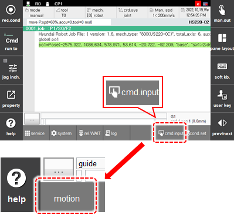
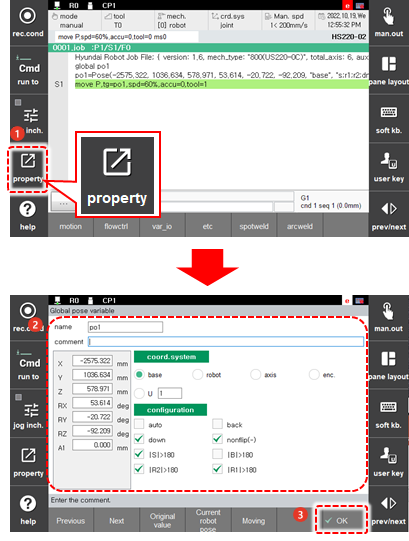

# 2.3.1.2 姿态

姿态是记录位置的参数。如果您通过使用`[Command]`按钮输入一个移动，您应该在tg \(target\)参数中指定姿态表达。当使用`[REC]`键输入移动指令时，tg参数将不会出现。在按下`[REC]`键的那一刻，操作器的位置和姿态将被记录，但不会在工作编辑屏幕上显示，这就是为什么它们被称为隐藏姿态。

输入姿态的方法如下。

1. 声明一个姿态变量，po1。
   选择[cmd.input > var_io > global or var]菜单，然后输入'po1'。
2. 使用`[cur.pose]`按钮将姿态变量初始化为姿态类型。
3. 执行声明和初始化命令，以便在每个命令的前面标记句点。
4. 按下`[cmd.input]`按钮后，选择`[motion]`，然后输入该语句。

    

5. 按下`[property]`按钮，设置当前机器人姿态的属性，然后按下`[Apply]`按钮。

    

 

姿态变量和偏移变量将以以下格式保存。

<table>
  <thead>
    <tr>
      <th style="text-align:center">姿态变量</th>
      <th style="text-align:center">偏移变量</th>
    </tr>
  </thead>
  <tbody>
    <tr>
      <td style="text-align:center">(X, Y, Z, Rx, Ry, Rz, {坐标系}, {config.})</td>
      <td style="text-align:center">(X, Y, Z, Rx, Ry, Rz, {坐标系})</td>
    </tr>
    <tr>
      <td style="text-align:center">
        
{坐标系}:

        
&quot;base&quot; = 基坐标系
           &quot;robot&quot; = 机器人坐标系
           &quot;user{n}&quot; = 用户坐标系 (n 指一个数字)
           &quot;joint&quot; = 关节坐标系
           &quot;encoder&quot;= 编码器

      </td>
      <td style="text-align:center">
        
{坐标系}:

        
&quot;base&quot; = 基坐标系
           &quot;robot&quot; = 机器人坐标系
           &quot;user{n}&quot; = 用户坐标系 (n 指一个数字)
           &quot;joint&quot; = 关节坐标系

      </td>
    </tr>
  </tbody>
</table>