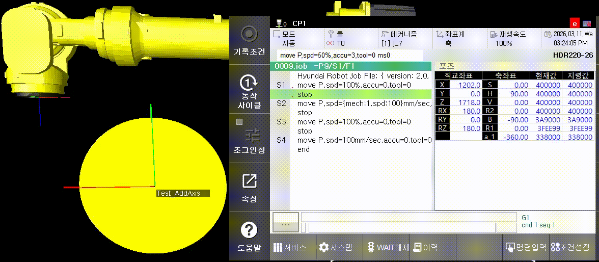
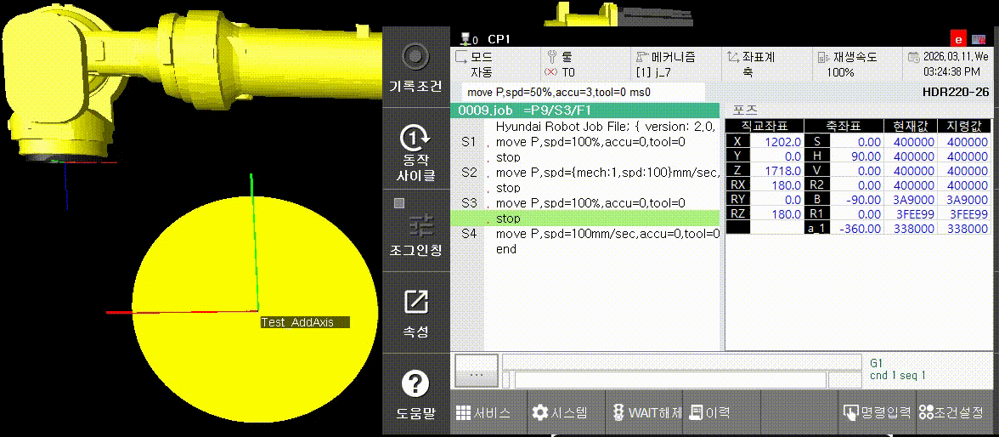

# 2.3.1.3 Speed

The operation speed of the robot can be displayed using the following four types of units. They can be used in all interpolation methods.

* mm/sec, cm/min: Sets the maximum speed of the TCP \(Tool Center Point\) of the robot.   The maximum speed of the robot will be automatically calculated by the controller based on the position and acceleration/deceleration parameters. If the setting value is larger than the maximum speed limit of the performance of the robot, the robot will operate only at the maximum speed limit.


* sec: Sets the robot moving time.  The shortest robot moving time will be automatically calculated by the controller based on the position and acceleration/deceleration parameters. If the setting value is shorter than the shortest time limit of the performance of the robot, the robot will operate only at the shortest time limit.


* %: Sets the ratio of the robot moving speed to the maximum speed at which the robot can operate.  When this is set to 100%, the robot will operate at the maximum speed within the allowable range.


### Mechanism-Specified Speed Planning
* {mech:Mechanism number, spd:Speed}(Speed unit) : Plans the speed trajectory of the corresponding step based on the selected mechanism number.
* Code example
```python
S2 move P,spd={mech:1,spd:100}mm/sec,accu=0,tool=0
```
| Mechanism-Specified Speed Planning (Mechanism 100mm/sec)| Robot Speed Planning (Robot 100mm/sec)| 
|---|---| 
|  |  |

* The yellow circle above indicates the additional axis set as Mechanism 1.
  * Mechanism-specified speed: The additional axis (Mechanism 1) generates a trajectory that matches the speed of 100 mm/sec.
  * Default setting: The robot generates a trajectory that matches the speed of 100 mm/sec.

<br>


The mechanism-specified speed planning feature is available from version V60.32-00.

* The specification applies only when the unit is mm/sec or cm/min.
* If the selected mechanism is in a stopped state, movement is performed based on the robot speed.
* If the additional axis is a rotational type, speed is planned in mm/sec or cm/min based on the rotation radius configured in the details of `[System → 5: Initialization → 5: Additional Axis Parameter Settings]`.
* When using the rotational positioner stationary weaving function, speed is planned based on the rotation radius of the workpiece on the positioner. (The positioner calibration must be completed.)


