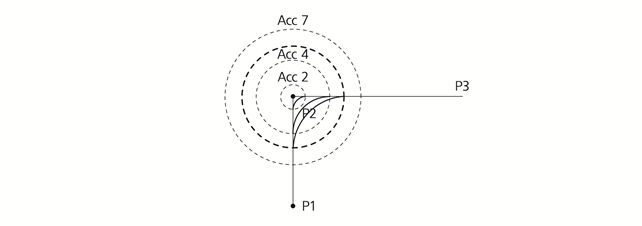
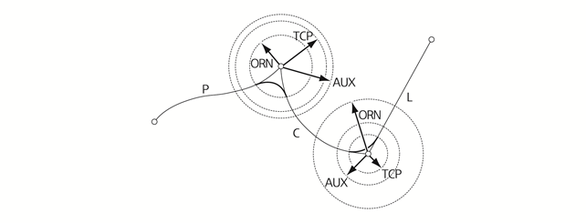
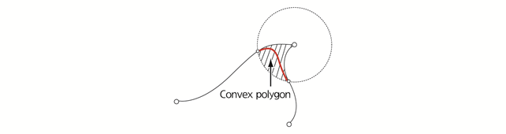

# 2.3.1.4 Accuracy

로봇이 목표 스텝을 진행할 때 그 스텝을 통과하는 정밀도\(기록 위치에 대한 접근 정도\)를 결정합니다. 로봇이 목표 스텝으로 이동할 때 발생하는 현재 위치와 기록 위치의 오차가 일정 수치보다 작으면 다음 스텝으로 이동합니다. 이때의 허용 오차값이 Accuracy입니다.

Accuracy에 의해 새롭게 만들어진 Accuracy 범위\(0 ~ 7\) 내에 있는 경로를 코너링 경로라고 합니다. 일반적으로 Accuracy가 클수록 코너링 속도가 빨라지므로 이동 시간 측면에서 유리합니다.

Accuracy 0이 가장 정밀하고 Accuracy 7은 오차가 가장 큽니다. Accuracy는 목표 스텝 양쪽 궤적 중 짧은 궤적 길이의 1/2보다는 크게 적용되지 않습니다. 즉, 위의 예에서 “Accuracy ≤ min\(P1-P2, P2-P3\) / 2” 수식을 적용할 수 있습니다. 이 수식에서는 TCP 거리로 설명하였으나 각도에서도 동일한 개념을 적용할 수 있습니다.

Accuracy level의 적용 값은 로봇의 경우에는 로봇의 툴 끝 거리 및 자세 각도로, 부가축의 경우에는 직동축은 길이, 회전축은 각도로 정의되며, 이 값은 \[**시스템** &gt; 3: 로봇 파라미터 &gt; 6: Accuracy\] 메뉴에서 직접 변경할 수 있습니다. Accuracy level의 적용 값에 대한 자세한 내용은 “[7.4.6 Accuracy](../../../7-system/4-robot-parameter/6-accuracy.md)”를 참조하십시오.

다음의 그림은 Accuracy level 값에 따라 코너링 경로가 어떻게 생성되는지 나타냅니다. 일반적인 6축 다관절 로봇과 부가축이 있는 경우 Accuracy 값은 TCP \(툴 끝 거리\), ORN \(자세 각도\), AUX \(부가축 거리\)를 개별적으로 설정할 수 있습니다. 해당 Accuracy level 값을 모두 만족시켜야 하므로 TCP, ORN, AUX 중 가장 작은 값을 기준으로 코너링 경로를 생성합니다. 코너링 경로는 항상 Convex hull property를 만족하면서 속도 변화에 무관하게 일정한 곡선으로 생성됩니다. 다만, 서보지연에 의해 저속과 고속에서는 수 밀리미터\(㎜\)의 오차가 발생할 수 있습니다.


Accuracy level 값에 따른 코너링 경로 생성 방식은 모든 보간 종류에서 동일하게 적용됩니다. P 보간인 경우에는 TCP 거리 Accuracy가 적용되지만 오차가 발생할 수 있습니다.


코너링 경로는 Convex hull property에 의해 다음의 convex polygon 영역을 벗어나지 않습니다.

