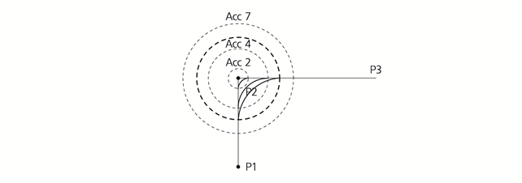
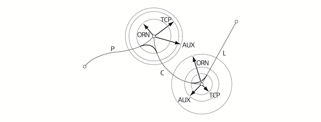

# 2.3.1.4 精度

它将决定机器人在进行目标步骤时经过该步骤的精度（接近记录位置的程度）。当机器人移动到目标步骤时，如果当前位置信息与机器人在移动到目标步骤时产生的记录位置之间的误差小于某个值，机器人将移动到下一个步骤。此时允许的误差值称为精度。

根据精度，在精度范围内（0~7）新创建的路径称为转弯路径。通常，精度越高，转弯速度越快，这在移动时间上是有利的。

精度 0 具有最高的精度，而精度 7 具有最大的误差。精度将以不超过目标步骤两个轨迹中较短轨迹长度的 1/2 的方式进行应用。换句话说，您可以在上述示例中应用表达式 “精度 ≤ min\(P1-P2, P2-P3\) / 2”。在此表达式中，TCP 距离用于解释，但同样的概念可以应用于角度。

在机器人的情况下，适用精度等级的数值将基于机器人的工具提示距离和姿态角度进行定义。当涉及附加轴时，线性轴的值将基于长度进行定义，旋转轴的值将基于角度进行定义。您可以直接更改 `[system - 3: Robot Parameter - 6: Accuracy]` 菜单中的值。有关精度等级值的详细信息，请参阅 “[7.4.6 精度](../../../7-system/4-robot-parameter/6-accuracy.md)”。

下面的图显示了如何根据精度等级的值创建转弯路径。如果有一个普通的 6 轴关节机器人和一个附加轴，则可以分别为 TCP（工具提示距离）、ORN（位置角度）和 AUX（附加轴距离）设置精度等级的值。因为所有相关精度等级的值都应满足，所以转弯路径将基于 TCP、ORN 和 AUX 中的最小值创建。转弯路径将以恒定曲线创建，无论速度变化如何，同时满足凸包性质。然而，在低速和高速下可能会因伺服延迟而出现几毫米（mm）的误差。


根据精度等级的值创建转弯路径的模式将以相同的方式应用于所有类型的插值。在 P 插值的情况下，将应用 TCP 距离精度，但可能会出现误差。


由于凸包性质，转弯路径不会超过凸多边形区域，如下所示。

