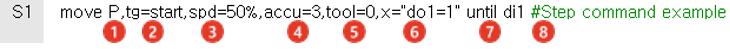

# 2.3.1 步骤语句参数

步骤语句参数是机器人步骤运动所需的运动条件，如机器人位置、插补、速度、精度以及工具编号，除了移动，一个运动命令。

步骤语句的参数分为默认参数和可选参数。默认参数是步骤所必需的基本参数，而可选参数是在必要时可以添加的参数。

步骤语句的配置如下。

<table>
  <thead>
    <tr>
      <th style="text-align:left">编号</th>
      <th style="text-align:left">参数</th>
      <th style="text-align:left">描述</th>
    </tr>
  </thead>
  <tbody>
    <tr>
      <td style="text-align:left">
        
      </td>
      <td style="text-align:left">插补</td>
      <td style="text-align:left">
        
步骤之间的插值路径

        
P (关节插补), L (线性插补), C (圆形插补),
          SP (静态工具插补关闭), SL (静态工具线性插补),
          SC (静态工具圆形插补)

      </td>
    </tr>
    <tr>
      <td style="text-align:left">
        
      </td>
      <td style="text-align:left">姿态</td>
      <td style="text-align:left">
        
记录位置的参数。此参数可以省略，并且姿态可以在语句后指定（隐式姿态）。

        
目标姿态 (X, Y, Z, Rx, Ry, Rz, Cfg) {坐标系} + 偏移 (X,
          Y, Z, Rx, Ry, Rz) {坐标系}

      </td>
    </tr>
    <tr>
      <td style="text-align:left">
        
      </td>
      <td style="text-align:left">速度</td>
      <td style="text-align:left">机器人的操作速度 (单位: mm/秒, cm/分钟, %, 秒)</td>
    </tr>
    <tr>
      <td style="text-align:left">
        
      </td>
      <td style="text-align:left">精度</td>
      <td style="text-align:left">在机器人移动到目标步骤时当前位
        置与记录位置之间允许误差的值 (0&#x2013;7)</td>
    </tr>
    <tr>
      <td style="text-align:left">
        
      </td>
      <td style="text-align:left">工具编号</td>
      <td style="text-align:left">使用的工具编号 (0&#x2013;31)</td>
    </tr>
        <tr>
      <td style="text-align:left">
        
      </td>
      <td style="text-align:left">赋值语句</td>
      <td style="text-align:left">移动开始时，赋值语句按从左到右的顺序逐个执行</td>
    </tr>
    <tr>
      <td style="text-align:left">
        
      </td>
      <td style="text-align:left">停止条件</td>
      <td style="text-align:left">机器人停止移动以执行下一个命令（步骤或功能）的条件</td>
    </tr>
    <tr>
      <td style="text-align:left">
        
      </td>
      <td style="text-align:left">注释</td>
      <td style="text-align:left">步骤的描述</td>
    </tr>
  </tbody>
</table>