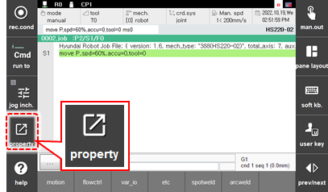
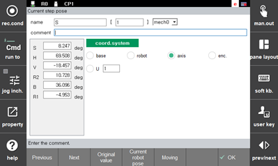

# 2.3.2.1 Axis Angle Recording Coordinate

In manual mode, if the \[1: Pose Recording Form\] option in the \[system&gt; 1: User Environment\] menu is set to axis angle, touch the \[property\] button in the move statement. The following attributes window will appear. The position of the robot recorded by the encoder can only be checked, and the position data cannot be modified.

