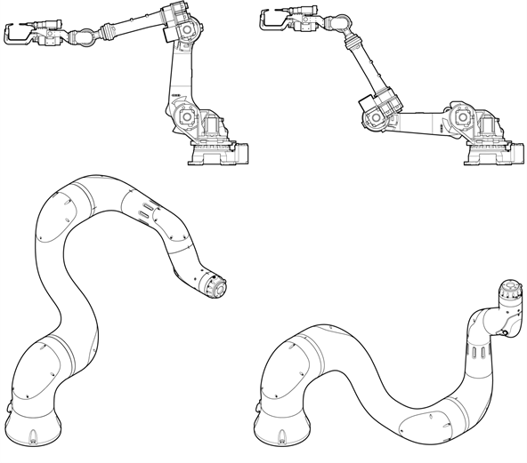
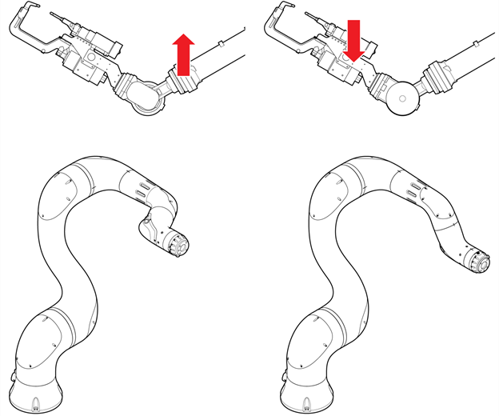

# 2.3.2.2 Base and Robot Recording Coordinates

The position and posture of the robot can be displayed differently depending on the coordinate system. If there is no travel axis, the base coordinate and the robot coordinate will generally be the same. If the travel axis is defined, the position and posture of the robot tool will be displayed differently depending on whether it is the base coordinate and the robot coordinate.

In manual mode, if the \[1: Pose Recording Form\] option in the \[Set up&gt; 1: User Environment\] menu is set to base or robot, touch the \[property\] button in the move statement. You can check the position and posture of the robot tool in the attributes window.


If you would like to change the pose recording form, please contact our customer support team to ask an expert or an engineer.


For one tooltip position and its orientation, there may be multiple postures because of the characteristics of the instrument, so to define one posture, the robot form \(config.\) should be designated.

Collaborative robots can be restricted by the soft limit because of their mechanical structures. When the robot is not in operation, you can release the soft limit or set it to a large value.

* auto: Regarding the current posture of the robot, the items that come later will be automatically determined. If this mode is not set, a determination will be performed based on whether the items below are designated or not.
* back: The tooltip of the robot is in the – direction on the X-axis of the robot coordinate system, meaning the rear. If this is not designated, the tooltip will be in the + direction, meaning the front. 
* down: Relationship between the H-axis and V-axis. If this is designated, the result will be the bottom. If this is not designated, the result will be top.

* flip: Flip with the B-axis coordinate being a + value. If this is not designated, the result will be non-flip with a - value. The red arrow in the figure shows the direction of the top of the wrist axis.

* S \(\|S\|&gt;=180\): The absolute value of the S-axis angle is more than 180 degrees. If not designated, it will be less than 180 degrees.
* 
  B \(\|B\|&gt;=180\): The absolute value of the B-axis angle is more than 180 degrees. If not designated, it will be less than 180 degrees.

* 
  R2 \(\|R2\|&gt;=180\): The absolute value of the R2-axis angle is more than 180 degrees. If not designated, it will be less than 180 degrees.

* R1 \(\|R1\|&gt;=180\): The absolute value of the R1-axis angle is more than 180 degrees. If not designated, it will be less than 180 degrees.

The coordinate system will be saved as \[Pose Variable\].crd \(Example: po32.crd\), and one of the following strings will be designated. If it is an empty string, the basic value will be recognized as joint.

<table>
  <thead>
    <tr>
      <th style="text-align:left"></th>
    </tr>
  </thead>
  <tbody>
    <tr>
      <td style="text-align:left">
        
Base coordinate system = &quot;base&quot;
           
        

        
Robot coordinate system = &quot;robot&quot;
           
        

        
Joint coordinate system = &quot;joint&quot;
           
        

        
Encoder = &quot;encoder&quot;
           
        

        
User coordinate system = &quot;u1&quot; &#x2013; &quot;u10&quot;
           
        

        

           
        

      </td>
    </tr>
  </tbody>
</table>

