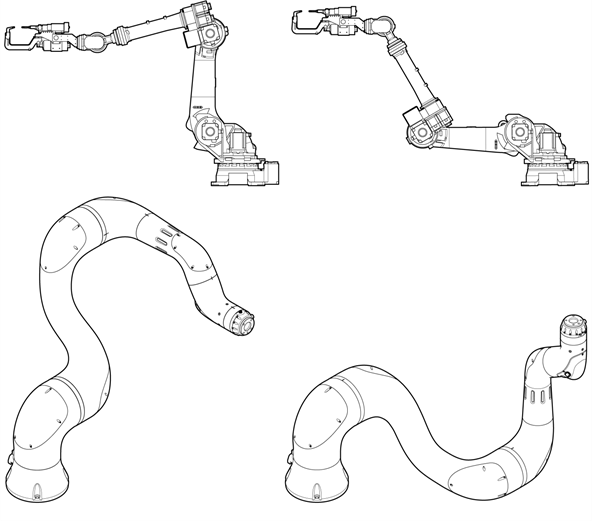
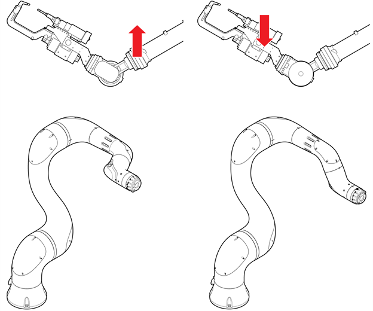

# 2.3.2.2 基座和机器人记录坐标

机器人的位置和姿态可以根据坐标系统以不同方式显示。如果没有移动轴，基座坐标和机器人坐标通常是相同的。如果定义了移动轴，机器人工具的位置和姿态将根据基座坐标和机器人坐标的不同而不同。

在手动模式下，如果在 `[system - 1: User Environment]` 菜单中将 `[1: Pose Recording Form]` 选项设置为基座或机器人，则触摸移动语句中的 `[property]` 按钮。您可以在属性窗口中检查机器人工具的位置和姿态。


如果您想更改姿态记录形式，请联系我们的客户支持团队以咨询专家或工程师。


对于一个工具提示位置及其方向，由于仪器的特性，可能会有多个姿态，因此为了定义一个姿态，机器人形式 \(config.\) 应该被指定。

协作机器人由于其机械结构可以受到软限制的限制。当机器人不在操作时，您可以解除软限制或将其设置为较大值。

* auto: 关于机器人的当前姿态，后面的项将自动确定。如果未设置此模式，则根据以下项是否被指定进行判断。
* back: 机器人的工具提示在机器人坐标系统的 X 轴的 - 方向上，表示后方。如果未指定，则工具提示将在 + 方向上，表示前方。
* down: H轴和V轴之间的关系。如果指定了这一点，结果将是底部。如果未指定，结果将是顶部。

* flip: B轴坐标为 + 值时翻转。如果未指定，结果将为非翻转并为 - 值。图中的红色箭头显示腕轴顶部的方向。

* `S (|S|>=180)`: S轴角度的绝对值大于 180 度。如果未指定，将小于 180 度。
* `B (|B|>=180)`: B轴角度的绝对值大于 180 度。如果未指定，将小于 180 度。

* `R2 (|R2|>=180)`: R2轴角度的绝对值大于 180 度。如果未指定，将小于 180 度。

* `R1 (|R1|>=180)`: R1轴角度的绝对值大于 180 度。如果未指定，将小于 180 度。

坐标系统将保存为 `[Pose Variable]`.crd \(示例: po32.crd\)，并将指定以下字符串之一。如果是空字符串，则基本值将被识别为关节。

<table>
  <thead>
    <tr>
      <th style="text-align:left"></th>
    </tr>
  </thead>
  <tbody>
    <tr>
      <td style="text-align:left">
        
基座坐标系统 = &quot;base&quot;
           
        

        
机器人坐标系统 = &quot;robot&quot;
           
        

        
关节坐标系统 = &quot;joint&quot;
           
        

        
编码器 = &quot;encoder&quot;
           
        

        
用户坐标系统 = &quot;u1&quot; &#x2013; &quot;u10&quot;
           
        

        

           
        

      </td>
    </tr>
  </tbody>
</table>