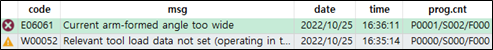

# 2.5.1 Error Type

Troubles in the robot system are composed of errors and warnings.

* Error: It is a trouble serious enough to stop the robot operation, and the code number in the notification message starts with E.

* Warning: The robot will continue to operate, but a warning is a trouble that requires you to check whether or not a response action has been taken. The code number in the notification message starts with W.
