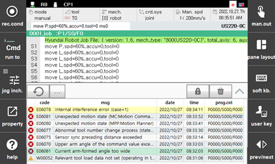
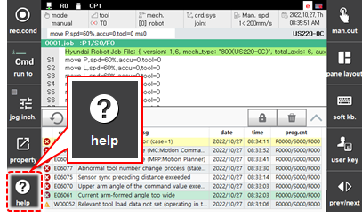
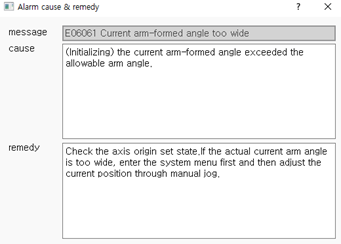

# 2.5.2 Error Handling

The following shows how to check and deal with various system troubles, such as system failures or operational errors.

* At the moment when a warning or error occurs, a notification with a code number and a title will appear on the guide display window.

  

* Touch [log] button on the guide display window. Then, the error and warning history will appear in a new window.

  * The error and warning history will be displayed in chronological order, and the most recent trouble will be highlighted with yellow.
  
  

  

* Touch the \[Help\] button on the L-button bar of the Hi6 teach pendant screen. You can check the error code, the notification message, the cause of the trouble, and how to take action for it.

  

  

