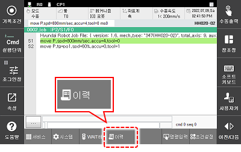
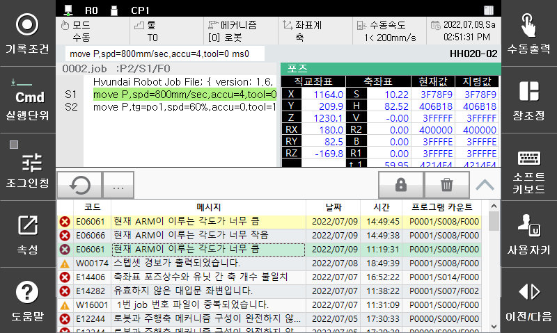
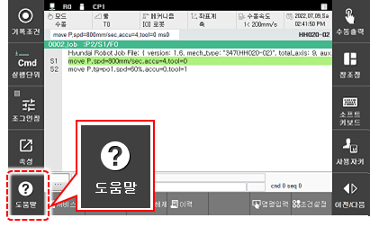
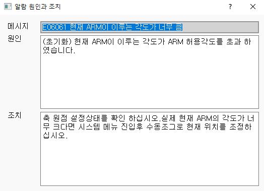

# 2.5.2 에러 처리

시스템 고장이나 조작 오류 등 다양한 시스템 문제를 확인하고 처리하는 방법은 다음과 같습니다.

* 이력 표시줄의 알림을 확인하십시오. 에러 코드와 알림 메시지, 에러 발생 시점이 나타납니다.

* 티치펜던트 하단에서 [로그] 버튼을 터치하십시오. 에러 및 경고 이력이 새 창으로 나타납니다.
  
  * 에러 및 경고 이력은 시간순으로 정렬되어 나타납니다. 위에 표시된 이력일 수록 최근에 발생한 에러입니다. 가장 최근에 발생한 문제는 노란 바탕색으로 하이라이트됩니다.

* Hi6 티치 펜던트 화면 좌측의 \[도움말\] 버튼을 터치하십시오. 에러 코드와 알림 메시지, 문제의 원인과 조치 방법을 확인할 수 있습니다.

