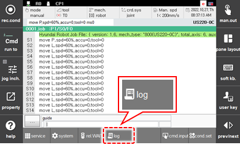
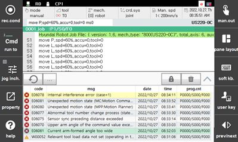
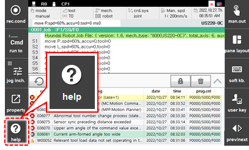
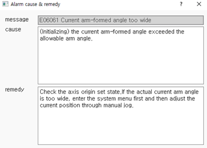

# 2.5.2 错误处理

以下展示了如何检查和处理各种系统故障，比如系统故障或操作错误。

* 当警告或错误发生时，带有代码号码和标题的通知将出现在指导显示窗口。

  

* 在指导显示窗口上点击 [log] 按钮。然后，错误和警告历史将会在一个新窗口中出现。

  * 错误和警告历史将按时间顺序显示，最新的故障将以黄色突出显示。
  
  

  

* 在 ${cont_model} 教学挂件屏幕的 L 按钮栏上点击 `[Help]` 按钮。您可以查看错误代码、通知消息、故障原因以及如何采取措施。

  

  