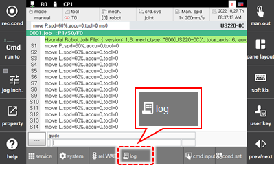
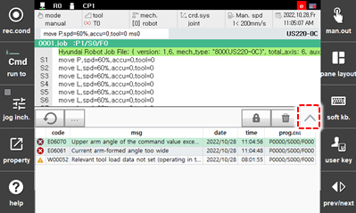
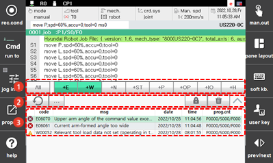

# 2.6 Log

Touch the \[Log\] button on the function button bar. Then, the log window will appear. 

You can check the logs of errors, warnings, notification, operations by the user, I/O, and executions. Touch the up-pointing arrow icon on the right side.

Additional options regarding the log are displayed as below.

<table>
  <thead>
    <tr>
      <th style="text-align:left">No.</th>
      <th style="text-align:left">Description</th>
    </tr>
  </thead>
  <tbody>
    <tr>
      <td style="text-align:left">
        
      </td>
      <td style="text-align:left">
        
You can set the type of log to be displayed in the list. If you touch the button of the desired type, only the logs that match the type will appear in the list.

        <ul>
          <li>[All]: You can check all types of logs.</li>
          <li>[+E]/[+W]: You can check the logs of errors or warnings.
             When a trouble occurs in the robot system, you can check and record the contents of the trouble, the time of trouble occurrence, as well as the program number, step number, axis data, and input/output status at the time of the trouble occurrence, and then manage the log of troubles. This makes it possible to analyze the cause of trouble or refer to the log of troubles that occurred prior to system recovery.</li>
          <li>[+N]: You can check the log of notifications.</li>
          <li>[+ST]: You can check the log of robot operations.
             When signals related to operation such as startup, stop, and mode change of the robot are inputted, the contents and time, as well as the program number, step number, axis data, and input/output status at the time of input, will be recorded. When the robot is repaired, you can refer to the log of the robot operation.</li>
          <li>[+P]: You can check the log of the status that will be periodically recorded.</li>
          <li>[+OP]: You can check the log of operation.</li>
          <li>[+IO]: You can check the log of the variation of the input and output signals.</li>
          <li>[+H]: You can check the log of the execution of the JOB program.</li>
        </ul>
      </td>
    </tr>
    <tr>
      <td style="text-align:left">
        
      </td>
      <td style="text-align:left">
        <ul>
          <li>[
            ]: You can open the pop-up menu.</li>
            <ul>
              <li>Save as log file: You can save the latest logs of the memory buffer as a file.</li>
          <li>Clear log file: You can clear the logs in memory buffer and delete all the log files. (Deleted files cannot be restored.)</li>
        </ul>
          <li>[
            ]: You can turn off the notification for a new log. The log will not be updated, and the current status will be maintained until the lock icon
            is turned off.</li>
          <li>[
            ]: You can delete the log displayed on the screen.</li>
        </ul>
      </td>
    </tr>
    <tr>
      <td style="text-align:left">
        
      </td>
      <td style="text-align:left"> <ul>A list of the logs of selected message types. You can check the detailed information of the logs for individual types. </ul></td>
    </tr>
  </tbody>
</table>

