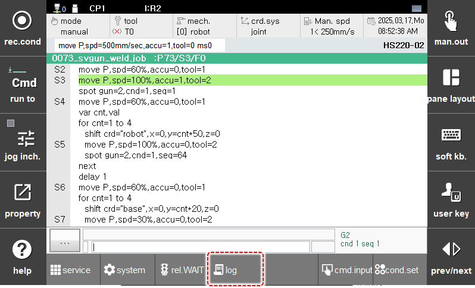
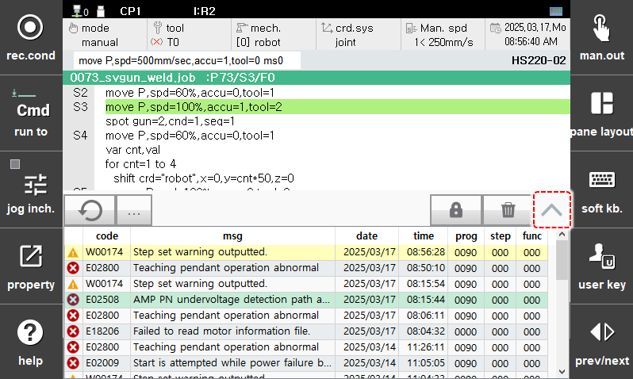
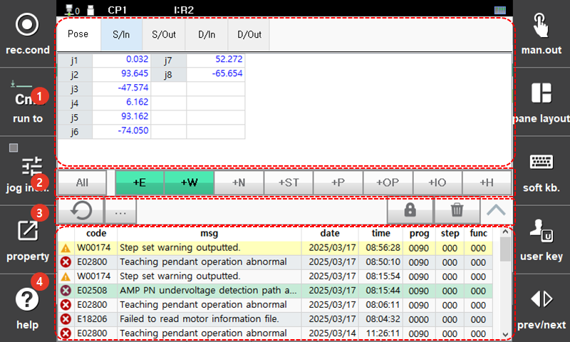
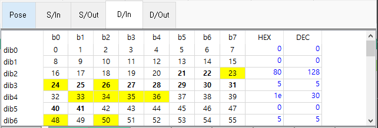

# 2.6 Event log

A log of events such as errors, warnings, notifications, start/stop actions, operations, changes in I/O values, and robot language executions that have occurred from the past to the present point in time is stored. (The maximum number of records stored varies depending on the type.) 
You can check the type, message, occurrence time, program/step/function number at the time of occurrence, and related auxiliary information for each log. This information can be used as a clue to analyze the cause of the issue and to respond it.

Touch the `[Log]` button on the function button bar. Then, the log window will appear. 

You can check the event logs. Touch the up-pointing arrow icon on the right side.

Filter options and auxiliary information for the log are displayed as below;


The display of auxiliary information is supported from V60.30-01.


<table>
  <thead>
    <tr>
      <th style="text-align:left">No.</th>
      <th style="text-align:left">Description</th>
    </tr>
  </thead>
  <tbody>
    <tr>
      <td style="text-align:left">
        
      </td>
      <td style="text-align:left">
        Aux. info.: The system's status at the time an error or warning occurs is also recorded, and you can view this in the aux. info. window. By clicking the tabs at the top, you can select and check the desired aux. info. The active input/output signal values are displayed with a yellow background, and assigned user I/O is shown in bold.
        <ul>  
          <li>Pose : Robot, additive axis values. (unit: mm or deg.)</li>
          <li>S/In : System input values. Only first 8bytes are recorded. (si0~63)</li>
          <li>S/Out : System output values. Only first 8bytes are recorded. (so0~63)</li>
          <li>D/In : User input values. Only fb0's first 32bytes are recorded. </li>(fb0.dib0~31)
          <li>D/Out : User output values. Only fb0's first 32bytes are recorded. </li>(fb0.dob0~31)
        </ul>
      </td>
    </tr>
    <tr>
      <td style="text-align:left">
        
      </td>
      <td style="text-align:left">
        You can use the filter buttons to display only the log of the desired type. When the filter button is turned on, the corresponding type will be displayed, and when turned off, it will be hidden.
        <ul>
          <li>[All]: Turn all filter buttons on or off at once.</li>
          <li>[+E]/[+W]: View error or warning log.</li>
          <li>[+N]: View notification (Notice) log.</li>
          <li>[+ST]: View robot start (START) and stop (STOP) log.</li>
          <li>[+P]: View periodically recorded status log.</li>
          <li>[+OP]: View user operation log.</li>
          <li>[+IO]: View input/output signal change log.</li>
          <li>[+H]: View job program execution log.</li>
        </ul>
      </td>
    </tr>
    <tr>
      <td style="text-align:left">
        
      </td>
      <td style="text-align:left">
        <ul>
          <li>[
            ]: You can open the pop-up menu.
            <ul>
              <li>Save as log file: Events are first stored in the memory buffer, and when the buffer is full, they are automatically saved to a file. By selecting this menu, any log still in the buffer will be immediately saved to a file.</li>
              <li>Clear log file: You can clear the logs in memory buffer and delete all the log files. (Deleted files cannot be restored.)</li>
            </ul>
          </li>
          <li>[
            ]: This function locks the display of new events on the screen. Even when locked, new events will continue to be recorded; only the screen refresh is blocked. This feature can be useful when the log screen keeps updating and obstructing your view. You can unlock it by pressing the lock button again or by closing and reopening the log window.
          </li>
          <li>[
            ]: This clears the events displayed on the screen. It only clears the screen, and the internally recorded log is not deleted.</li>
          <li>[
            ]: When the log screen is cleared, pressing this button will retrieve the log again and display it on the screen.</li>
        </ul>
      </td>
    </tr>
    <tr>
      <td style="text-align:left">
        
      </td>
      <td style="text-align:left">This is the log of the selected type. New events are highlighted at the top with a yellow background.</td>
    </tr>
  </tbody>
</table>

