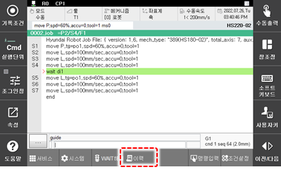

# 2.6 이력

패널 선택창에서 하단의 \[이력\]을 터치하십시오. 이력창이 나타납니다.

에러, 경고, 알림, 운전, 사용자 작동, I/O, 실행에 대한 이력을 확인할 수 있습니다. 오른쪽 위방향 화살표를 터치하십시오.

아래 그림과 같이 이력에 대한 추가 옵션들이 표시됩니다.

<table>
  <thead>
    <tr>
      <th style="text-align:left">번호</th>
      <th style="text-align:left">설명</th>
    </tr>
  </thead>
  <tbody>
    <tr>
      <td style="text-align:left">
        
      </td>
      <td style="text-align:left">
        
목록에 표시할 이력의
          유형을 설정할 수 있습니다.
          원하는 유형의 버튼을
          터치하면 해당 유형에
          속하는 이력만 목록에
          나타납니다.

        <ul>
          <li>[전부]: 모든 유형의 이력을
            확인합니다.</li>
          <li>[+E]/[+W]: 에러 또는 경고 이력을
            확인합니다.
             로봇 시스템에 문제가
            발생하면 문제의 내용과
            발생 시각, 발생 시점의
            프로그램 번호, 스텝 번호,
            축 데이터, 입출력 상태를
            확인하고 기록하여 문제
            이력을 관리합니다. 그리고
            문제의 원인을 분석하거나
            시스템 복구 시 이전에
            발생한 문제의 이력을
            참조합니다.</li>
          <li>[+N]: 알림 이력을 확인합니다.</li>
          <li>[+ST]: 로봇을 운전한 이력을
            확인합니다.
             로봇의 기동, 정지 및 모드
            변경 등 운전과 관련된
            신호가 입력되면 내용과
            시각, 입력 시점의 프로그램
            번호, 스텝 번호, 축 데이터,
            입출력 상태를 기록합니다.
            그리고 로봇 보수 시 로봇
            운전 이력을 참조합니다.</li>
          <li>[+P]: 주기적으로 기록되는
            상태 이력을 확인합니다.</li>
          <li>[+OP]: 조작 이력을 확인합니다.</li>
          <li>[+IO]: 입출력 신호의 변화
            이력을 확인합니다.</li>
          <li>[+H]: JOB 프로그램의 실행 이력을
            확인합니다.</li>
        </ul>
      </td>
    </tr>
    <tr>
      <td style="text-align:left">
        
      </td>
      <td style="text-align:left">
        <ul>
          <li>[num.]: 드롭다운 메뉴를 터치하여
            목록에 표시할 이력의
            수(30, 100, 200, 500, 1000)를 조정할 수
            있습니다. 이력의 수를
            선택하면 해당 개수만큼의
            최근 이력을 다시 불러와
            화면에 표시합니다.</li>
          <li>[
            ]: 팝업 메뉴를 엽니다.
            <ul>
              <li>log 파일로 저장: 메모리
                버퍼의 최신 이력을 파일로
                저장합니다.</li>
              <li>log 파일 클리어: 메모리
                버퍼의 이력을 클리어하고
                이력 파일을 모두 삭제합니다.(삭제된
                파인 복구할 수 없습니다.)</li>
            </ul>
          </li>
          <li>[
            ]: 새로운 이력의 알림을
            끕니다. 잠금 표시를 풀
            때까지 이력은 갱신되지
            않고 현재 상태가 유지됩니다.</li>
          <li>[
            ]: 화면에 표시된 이력을
            클리어합니다.</li>
        </ul>
      </td>
    </tr>
    <tr>
      <td style="text-align:left">
        
      </td>
      <td style="text-align:left">선택한 유형의 이력 목록입니다.
        유형별 이력의 상세 정보를
        확인할 수 있습니다.</td>
    </tr>
  </tbody>
</table>

