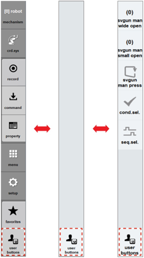

# 2.6.1 Switching of the User Button Area

Touch the \[User buttons\] button on the right side of the Hi6 teach pendant screen until the desired area appears. Then, the menu button area will be switched to the user button area. In the user key area, the key signal output function and the spot application function are assigned and provided by default.

* If you press the \[User buttons\] button while pressing the &lt;shift&gt; key, you can switch the area in the opposite direction.
* In the user button area, the key signal output function and the spot application function are assigned.
  * 
    The key signal output function area will stay empty as the initial state in which no button is registered.

  * 
    The spot application function area will have buttons registered, which can be used for teaching the robot.

