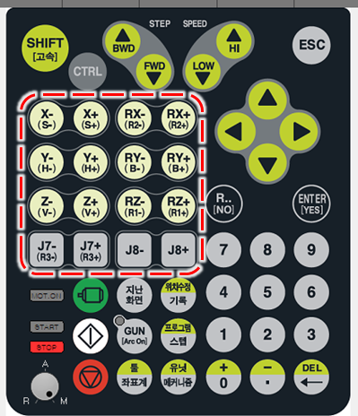

# 2.7.1 조그키

수동 모드에서 사용합니다. 모터가 켜진 상태에서 인에이블링 스위치를 잡고 있는 동안 티치 펜던트의 조그키를 눌러 로봇을 저속으로 움직일 수 있습니다.

로봇의 동작 방향은 현재 선택된 좌표계에 따라 달라집니다. 축 좌표계일 때는 각 축이 개별적으로 동작하고, 로봇 좌표계, 사용자 좌표계, 툴 좌표계일 때는 선택된 직교 좌표계의 방향대로 툴 끝이 이동하도록 로봇의 여러 축이 동시에 움직입니다.

J7, J8의 키는 로봇의 종류와 부가축 설정상태에 따라 다르게 동작 합니다. 7축 로봇의 경우 J7은 3번째 축인 R3축에 할당된 조그키로 동작 합니다. 기타 기종의 경우 ‘티치펜던트 옵션’메뉴에서 조그키 사용으로 설정한 경우 메커니즘의 설정에 따라 각각의 부가축이 할당될 수 있습니다. 

조그 시 선택된 메커니즘이 메커니즘\[0\] 로봇인 경우에 한하여 다음 메커니즘\[1\]의 전체 축 개수가 2축 이하이면 등록된 부가축의 순서에 따라 각각 할당됩니다. 이때 메커니즘\[1\]에서 할당되지 않은 키가 남아 있고 그 다음 메커니즘이 잔여 키에 할당 가능한 축 개수 이내로 되어 있는 경우 순차적으로 할당됩니다.

예를 들어, 부가축 메커니즘의 축 개수에 따른 J7, J8축에 대한 할당 여부는 다음과 같습니다.

| 메커니즘\[0\] | 메커니즘\[1\] | 메커니즘\[2\] | J7축 / J8축 할당 여부 |
| :--- | :--- | :--- | :--- |
| 6축 로봇 | 주행축1 축 | 포지셔너 1축 | J7: 주행축 / J8: 포지셔너 |
| 6축 로봇 | 주행축1 축 | 포지셔너 2축 | J7: 주행축 / J8: 미할당 |
| 6축 로봇 | 주행축2 축 | 포지셔너 2축 | J7: 주행축 1 / J8: 주행축 2 |
| 6축 로봇 | 주행축3 축 | 포지셔너 1축 | J7: 미할당 / J8: 미할당 |

