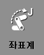
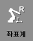
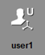
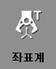
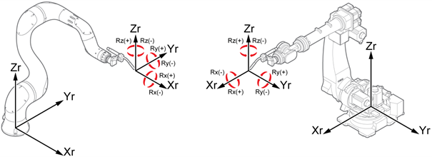
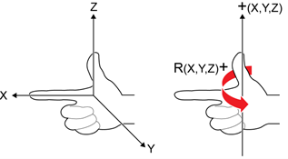

# 2.7.3 로봇 좌표계

| 축 좌표계 | **로봇 좌표계** | 사용자 좌표계 | 툴 좌표계 |
| :---: | :---: | :---: | :---: |
|    |   |   |   |

1.	수동 모드에서 모터를 켜고 티치 펜던트 뒷면의 인에이블링 스위치를 잡으십시오.

2.	Hi6 티치 펜던트 화면 우측의 \[좌표계\] 버튼을 반복해서 터치하여 로봇 좌표계를 선택하십시오. 조그 막대에 X, Y, Z, RX, RY, RZ와 부가축이 표시됩니다.

3.	조그키로 로봇을 동작하십시오. 로봇이 다음과 같이 움직입니다.


* 조그키에 대한 로봇의 진행 방향에 대한 자세한 내용은 “[2.7.1 조그키](1-jog-key.md)”를 참조하십시오.
* 오른손을 이용하면 로봇 좌표계에서 로봇의 동작을 쉽게 이해할 수 있습니다.

 

그림 27 좌표계 방향\(좌\) / 회전 방향\(우\)

* 로봇 뒷면에서 오른손 검지 손가락의 진행 방향을 로봇 좌표계의 X방향으로 두면, 엄지 손가락의 진행 방향이 Z방향, 중지 손가락의 진행 방향이 Y방향이 됩니다.
* 오른손 엄지 손가락을 회전 중심축 방향으로 두면, 나머지 손가락을 접은 방향이 회전 방향의 + 방향입니다.


