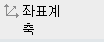
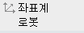
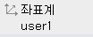
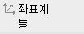
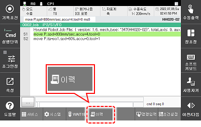
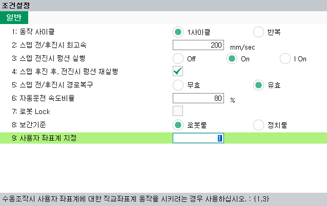
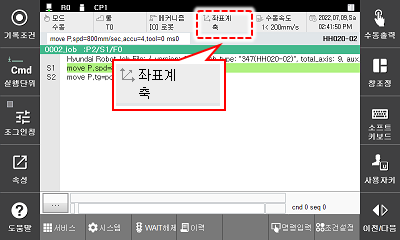

# 2.7.4 사용자 좌표계

<table>
	<th>축 좌표계</th>
	<th>로봇 좌표계</th>
	<th style="background:lightgreen">사용자 좌표계</th>
	<th>툴 좌표계</th>
<tr>
	<td></td>
	<td></td>
	<td></td>
	<td></td>
</tr>
</table>

1.	초기 화면 하단의 \[**시스템**\] 버튼 &gt; \[2: 제어 파라미터 &gt; 7: 좌표계 등록 &gt; 1: 사용자 좌표계\] 메뉴를 터치한 후 사용자 좌표계를 등록하십시오.


사용자 좌표계 등록 방법에 대한 자세한 내용은 “[7.3.6.1 사용자 좌표계](../../7-setting/3-control-parameter/6-cordsys-reg/1-user-crdsys.md)”를 참조하십시오.


2.	초기 화면 우 하단의 \[조건설정\] 버튼을 터치한 후 \[9: 사용자 좌표계 지정\] 옵션에 좌표계를 설정하십시오. 직교 좌표계 대신 사용자 좌표계를 선택할 수 있습니다.

3.	티치펜던트의 \[좌표계\] 키나 상태막대의 좌표계 버튼을 반복해서 눌러, 사용자 좌표계를 선택하십시오.

4.	조그키로 로봇을 동작하십시오. 로봇이 다음과 같이 움직입니다.


조그키에 대한 로봇의 진행 방향에 대한 자세한 내용은 “[2.7.1 조그키](1-jog-key.md)”를 참조하십시오.


