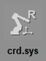

# 2.7.5 Tool Coordinate System

| Joint Coordinate System | Robot Coordinate System | User Coordinate System | **Tool Coordinate System** |
| :---: | :---: | :---: | :---: |
|    |   |   |   |

1.	Turn on the motor in manual mode and hold the enabling switch on the back of the teach pendant.

2.	Select the tool coordinate system by repeatedly touching the \[Crd. Sys\] button on the right side of the Hi6 teach pendant screen. Then, the jog bar will display X, Y, Z, RX, RY, RZ, and additional axes.

3.	Operate the robot with the jog keys. The robot will move as follows.

* If a torch is attached to the robot

* If no torch is attached to the robot


For details on the robot’s progress direction in relation to the jog keys, refer to “[2.7.1 Jog Keys](1-jog-key.md).”


