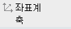
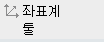

# 2.7.5 툴 좌표계

<table>
	<th>축 좌표계</th>
	<th>로봇 좌표계</th>
	<th>사용자 좌표계</th>
	<th style="background:lightgreen">툴 좌표계</th>
<tr>
	<td></td>
	<td></td>
	<td></td>
	<td></td>
</tr>
</table>

1.	수동 모드에서 모터를 켜고 티치 펜던트 뒷면의 인에이블링 스위치를 잡으십시오.

2.	티치펜던트의 <**좌표계**> 키나 상태 표시줄의 [**좌표계**] 버튼을 반복해서 눌러, 툴 좌표계를 선택하십시오.

3.	조그키로 로봇을 동작하십시오. 로봇이 다음과 같이 움직입니다.

* 로봇에 토치를 부착한 경우

* 로봇에 토치를 부착하지 않은 경우


조그키에 대한 로봇의 진행 방향에 대한 자세한 내용은 “[2.7.1 조그키](1-jog-key.md)”를 참조하십시오.


