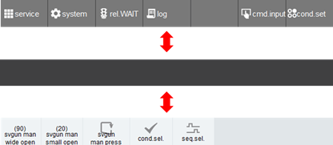

# 2.7.1 Switching of the User Key Area

Touch the \[user key\] button on the R button bar of the Hi6 teach pendant screen until the desired area appears. Then, the menu button area will be switched to the user button area. In the user key area, the key signal output function and the spot application function are assigned and provided by default.

* If you press the \[user key\] button while pressing the &lt;shift&gt; key, you can switch the area in the opposite direction.
  
* The key signal output function area will stay empty as the initial state in which no button is registered.

  

