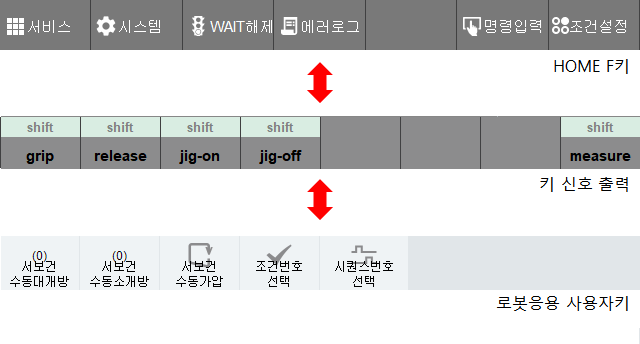

# 2.7.1 用户密钥区域的切换

在 ${cont_model} 教导挂件屏幕的 R 按钮栏上，触摸 `[user key]` 按钮，直到出现所需区域。然后，菜单按钮区域将切换到用户按钮区域。在用户密钥区域，密钥信号输出功能和点应用功能是默认分配和提供的。

* 如果您在按住 `shift` 键的同时按下 `[user key]` 按钮，可以向相反方向切换区域。
  
* 密钥信号输出功能区域将保持为空，即没有注册按钮的初始状态。