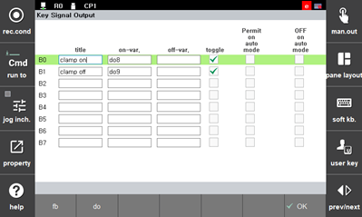
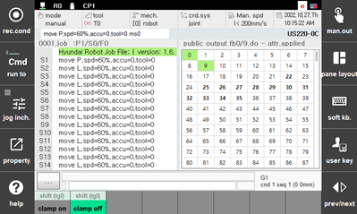

# 2.7.2.1 Key Signal Output Function Area

You can simply turn on/off the desired output signal by registering it with a button.

1.	Touch the \[user key\] button repeatedly until the key signal output function area appears.

2.	While pressing the &lt;ctrl&gt; key, touch the \[user key\] button. The key signal output setting window will appear.

3.	After setting the function name and option to display on the button, touch the \[OK\] button.

    

* \[Title\]: This is the function name to be displayed on the button.
* \[on-var.\]: This is the name of the signal output variable or of the number type variable. This is the name of the variable whose value will be turned ON \(assign 1\) when the button is turned ON.
* \[off-var.\]: This is the name of the signal output variable or the number type variable. This is the name of the variable whose value will be turned ON \(assign 1\) when the button is turned OFF.
* \[Toggle\]: This helps you perform the setting in a way that the functions registered with the buttons can be activated or deactivated whenever you touch the buttons. If the toggle function is not used, the functions registered with the button will be activated only while the button is being touched.
* \[Permit on Auto Mode\]: This allows the variable value output function even in automatic mode.
* \[Off on Auto Mode\]: This turns off all variable values \(assign 0\) in automatic mode.

 


You can easily input the signal output variable value using the \[fb\] button and the \[do\] button. For example, input 2.9 and press the <<b>ENTER</b>> key. It will be converted to and displayed as fb2.do9. If you input 9 without decimal point and press the <<b>ENTER</b>> key, it will be converted to do9.


4.	Check the buttons in the key signal output function area, and touch each button to make sure that the set value is properly applied.

    


You can also assign the desired output signals to the buttons in the key signal output function area in the \[system &gt; 2: Control Parameter &gt; 2: Input/Output Signal Setting &gt; 5: Key Signal Output\] menu. For details, refer to "[7.3.2.8 Key Signal Output](../../../7-system/3-control-parameter/2-io-signal-setting/8-key-signal-output.md)".


