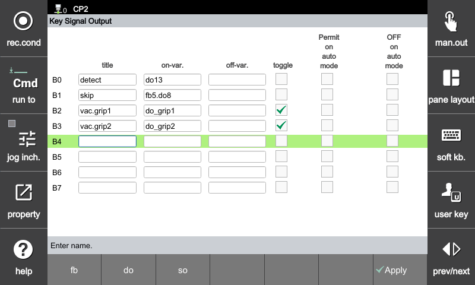
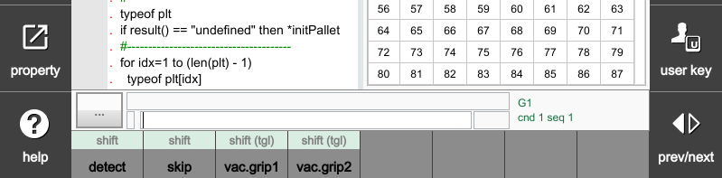

# 2.7.2.1 Key Signal Output Function Area

`Key Signal Output` is a function that allows you to assign a desired variable to an F-key and set the value of that variable to 1 or 0 through button operation.
It is mainly used to turn I/O output signals ON or OFF by operating an F-key to which an output variable has been assigned.
(All types of variables can be specified, including general variables, aliases, and output variables.)

You can open the `Key Signal Output` buttons by pressing `[R4: User Key]` on the right side of the HOME screen.
If no settings have been made, all buttons will be empty.

You can configure the buttons as follows:

1. With the `Key Signal Output` buttons open, touch `[CTRL] + [User Key]`.
The `Key Signal Output Setting` window appears.

2. Set the function name and options to be displayed on the button, then touch `[F7: OK]`.

* `title`: Name displayed on the button
* `on-var`: When a variable name is specified, the value 1 is assigned to the variable at the moment the button is turned ON.
* `off-var`: When a variable name is specified, the value 1 is assigned to the variable at the moment the button is turned OFF.
* `toggle`:
  + Checked: The button toggles between ON and OFF each time it is pressed.
  + Unchecked: The button turns ON when pressed and turns OFF when released.
* `Permit on auto mode`:
  + Checked: This function operates even in Auto mode.
  + Unchecked: This function does not operate in Auto mode.
* `OFF on auto mode`: When switching to Auto mode, all variables set for this function are turned OFF.


For `on-var` and `off-var`, for example, if you enter 3.5 and press `[ENTER]`, fb3.do5 is entered.
If you enter 5 and press `[ENTER]`, do5 is entered.
Alternatively, you can use the F-keys [fb], [do], and [so] at the bottom of the screen to enter values.


3. Open the `Key Signal Output` buttons and touch the registered F-key together with the `[SHIFT]` key to verify that the settings have been applied correctly.


You can also access the same setting screen from
`[F2: system] – 2: Control parameter – 2: Input/Output signal setting – 5: Key signal output`.
For more details, refer to "[7.3.2.8 Key Signal Output](../../../7-system/3-control-parameter/2-io-signal-setting/8-key-signal-output.md)"".

