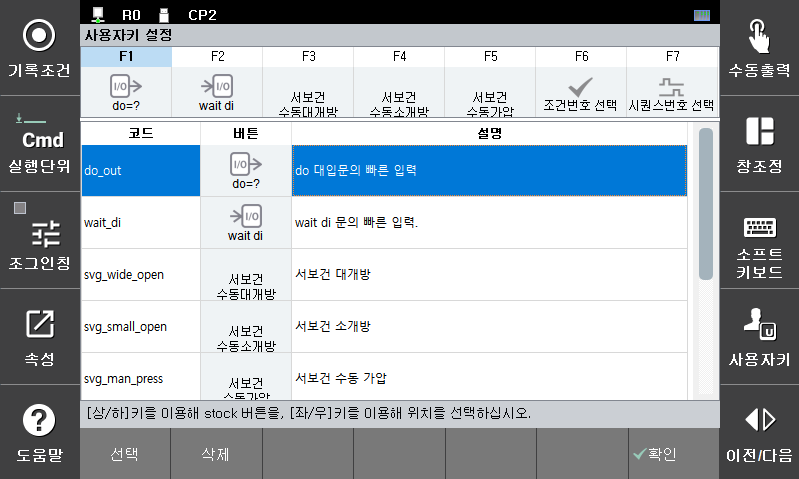

# 2.7.2.2 机器人应用用户键配置

在 ${cont_model} 教学 pendant 屏幕的 R 按钮栏上触摸 `[user key]` 按钮，直到所需区域出现。然后，F 按钮区域将切换到机器人应用用户键区域，例如点焊条和弧焊条。

按下 `控制 (ctrl)` 键并按下 `user-key` 按钮，打开一个配置屏幕，您可以在其中调整用户按钮的布局。

屏幕底部的列表是可选择的 F 按钮列表，您可以使用 `[Arrow Up]`/`[Arrow Down]` 移动光标。

屏幕顶部是用户按钮的布局，您可以使用 `[Arrow Left]`/`[Arrow Right]` 移动光标。

按下 `[ENTER]` 键或 `[F1:选择] ([F1:Select])` 按钮将所选 F 按钮放置到所选位置。
如果按下 `[DEL]` 键或 `[F2:删除] ([F2:Delete])` 按钮，则所选位置的按钮将被删除并变为空。

完成放置后，按下 `[F7:确定] ([F7:OK])` 按钮以保存用户按钮布局。

* 有关点焊应用功能的详细信息，请参阅 "[${cont_model} 控制器点焊功能手册](https://hrbook-hrc.web.app/#/view/doc-spot-weld/zh/README)"。

* 有关弧焊应用功能的详细信息，请参阅 "[${cont_model} 控制器弧焊功能手册](https://hrbook-hrc.web.app/#/view/doc-arc-weld/zh/README)"。