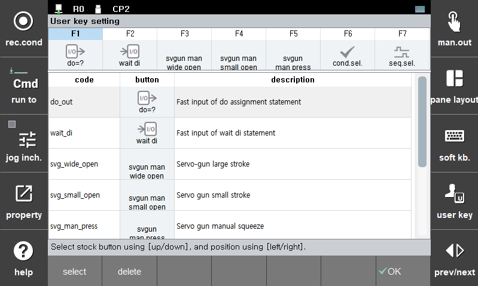

# 2.7.2.2 로봇 응용 사용자키 설정

원하는 영역이 나타날 때까지 Hi6 티치 펜던트 화면 우측의 \[사용자키\] 버튼을 터치하십시오. 메뉴 버튼 영역이 스폿용접 막대, 아크용접 막대 등 로봇응용 사용자키 영역으로 전환됩니다.

`ctrl`키를 누른 상태에서 `[사용자키]`버튼을 누르면, 사용자 버튼의 배치를 조정할 수 있는 설정화면이 열립니다.

화면 하단의 리스트는 선택 가능한 F버튼들의 리스트이며, `[화살표 상]`/`[화살표 하]`로 커서를 이동할 수 있습니다.
화면 상단은 사용자 버튼의 배치이며, `[화살표 좌]`/`[화살표 우]`로 커서를 이동할 수 있습니다.
`[ENTER]` 키 혹은 `[F1:선택]` 버튼을 누르면, 선택된 F버튼이 선택된 위치로 배치됩니다.
`[DEL]` 키 혹은 `[F2:삭제]` 버튼을 누르면, 선택된 위치의 버튼이 삭제되어 빈 자리가 됩니다.

배치를 완료한 후 `[F7:완료]` 버튼을 누르면, 사용자 버튼 배치가 저장됩니다.

* 스폿 응용 기능에 대한 자세한 내용은 별도의 "[Hi6 로봇언어 기능 설명서 - 스폿 용접](https://hrbook-hrc.web.app/#/view/doc-spot-weld/korean/README)"를 참조하십시오.

* 아크 응용 기능에 대한 자세한 내용은 별도의 "[Hi6 로봇언어 기능 설명서 - 아크 용접](https://hrbook-hrc.web.app/#/view/doc-arc-weld/korean/README)"를 참조하십시오.
