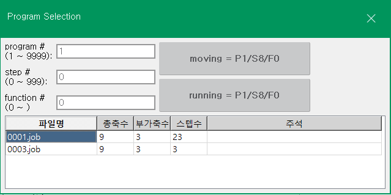
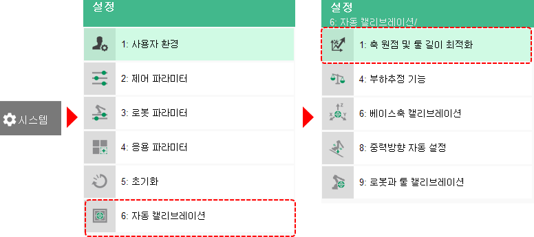
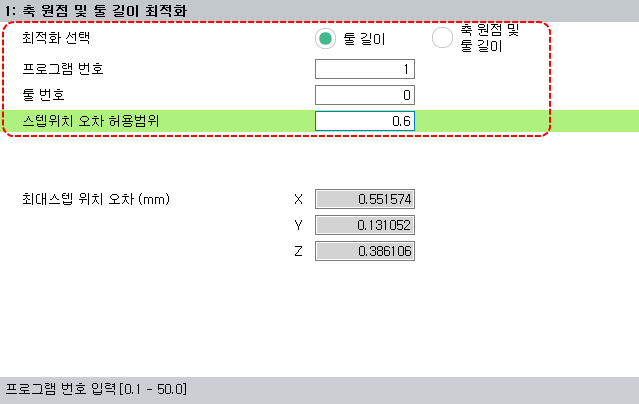

# 2.8 축 원점 및 툴 길이 최적화 설정

직선보간 궤적 및 좌표변환 정도의 향상을 위해 축 정수와 툴 길이를 자동으로 설정합니다.

* 3차원상에서 측정하기 어려운 툴 끝까지의 거리를 자동으로 설정할 수 있습니다. 보정되는 파라미터는 H, V, R2, B축의 축 원점과 X, Y, Z방향 툴 길이입니다.
* ‘축 원점 및 툴 길이’와 ‘툴 길이’ 최적화를 실행할 수 있습니다.


로봇 프로그램을 티칭하기 전에 ‘축 원점 및 툴 길이’를 최적화하십시오. 로봇 프로그램이 만들어진 상태에서 ‘축 원점 및 툴 길이’를 최적화하면 기존 프로그램의 위치가 변경될 수 있습니다.


축 원점 및 툴 길이 최적화를 설정하는 방법은 다음과 같습니다.

1.	티치 펜던트의 모드 스위치를 이용해 운전 방식을 수동 모드로 설정하십시오.

2.	[SHIFT]+\[프로그램\] 키를 누른 후 프로그램 번호를 입력하고 \[ENTER\] 키를 누르십시오.

3.	티치 펜던트의 &lt;모터&gt; 키를 누르십시오. 모터 램프가 깜빡입니다.

* 모터가 켜지지 않으면 이력 표시줄에서 에러 메시지를 확인하고 문제를 해결하십시오.

4.	티치 펜던트 뒷면의 인에이블링 스위치를 잡은 채로 조그키를 이용해 로봇을 동작하십시오

5.	로봇의 동작 범위 내 임의의 위치에 뾰족한 침을 두고 로봇의 툴 끝을 침에 일치시키십시오. 로봇 선단부터 일치시킨 툴 끝까지의 길이가 최적화됩니다.

6.	티치 펜던트의 \[기록\] 키를 눌러 스텝을 기록하십시오.

7.	로봇의 자세를 바꾸고 5 ~ 6번 단계를 4번 이상 반복하십시오.

* 가능한 한 6축 전체를 이용하여 로봇의 자세를 바꾸십시오. 또한 축의 각도는 30 deg 이상 변경하십시오.

8.	\[시스템\] 버튼 &gt; \[6: 자동 캘리브레이션 &gt; 1: 축 원점 및 툴 길이 최적화\] 메뉴를 선택하십시오.

9.	자동 캘리브레이션용으로 작성한 프로그램 번호, 툴 번호, 스텝 위치 오차 허용 범위를 설정한 후 \[실행\] 버튼을 터치하십시오. 선택된 축 원점 및 툴 길이가 설정됩니다.

* 여러 개의 툴을 사용할 때, 두 번째 툴의 자동 캘리브레이션부터는 \[최적화 선택\] 옵션을 툴 길이로 선택하여 실행하십시오. 축 원점 및 툴 길이를 선택하면 먼저 설정한 툴의 정보가 맞지 않게 됩니다.


이 기능에 대한 자세한 내용은 “[7.7.1 축 원점 및 툴 길이 최적화](../7-setting/7-auto-calibration/1-axis-origin-tool-length-optimization.md)”를 참조하십시오.


