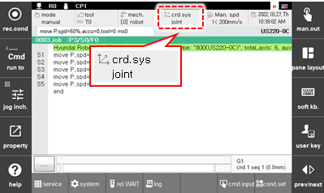
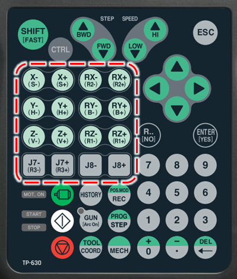

# 2.8.1 Jog Keys

It can be used in manual mode. When you are holding the enabling switch, with the motor ON and pressing jog keys, you can move the robot at a low speed.

The direction of the robot motion depends on the reference coordinate system. The joints moves individually in the axis corrdinate system, while they move simultaneously in other corrdinate systems so that the TCP can move in the direction of the selected rectangular coordinate system.

The motions of J7 and J8 keys are determined by how you set the robot model and additional axes. J7 in a 7-axes robot can be operated by the jog key assigned at R3 axis, the third axis. For other type robots,  you can operate the additional axes with jog keys, according to the mechanism setting.

Only in the case in which the selected mechanism is mechanism \[0\] robot selected during jogging, if the total number of axes of the next mechanism \[1\] is less than two, they will be assigned according to the order of the registered additional axes. At this time, if unassigned keys remain in the mechanism \[1\] and the next mechanism has room, in terms of the number of axes to which the remaining axes can be assigned, they will be sequentially assigned.

For example, whether to perform an assignment for the axes J7 and J8 according to the number of axes of the mechanisms for the additional axes will be as follows.

| Mechanism \[0\] | Mechanism \[1\] | Mechanism \[2\] | Whether to assign for J7 axis / J8 axis |
| :--- | :--- | :--- | :--- |
| 6-axis robot | Travel axis, Axis 1 | Positioner, Axis 1 | J7: Travel axis / J8: Positioner |
| 6-axis robot | Travel axis, Axis 1 | Positioner, Axis 2 | J7: Travel axis / J8: Not assigned |
| 6-axis robot | Travel axis, Axis 2 | Positioner, Axis 2 | J7: Travel axis 1 / J8: Travel axis 2 |
| 6-axis robot | Travel axis, Axis 3 | Positioner, Axis 1 | J7: Not assigned / J8: Not assigned |

