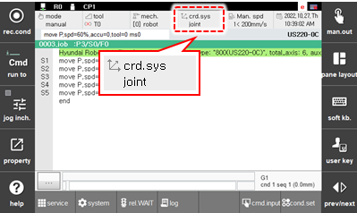
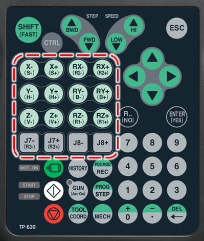

# 2.8.1 Jog Keys

它可以在手动模式下使用。当您按住使能开关，电机开启并按下 jog 按键时，您可以以低速移动机器人。

机器人的运动方向取决于参考坐标系。关节在轴坐标系中单独移动，而在其他坐标系统中同时移动，以便 TCP 可以朝选定的矩形坐标系方向移动。

J7 和 J8 按键的运动由您设置的机器人模型和附加轴决定。7 轴机器人的 J7 可以通过分配给 R3 轴（第三轴）的 jog 按键进行操作。对于其他类型的机器人，您可以根据机制设置通过 jog 按键操作附加轴。

仅在所选机制为在 jog 时选择的机制 `[0]` 的情况下，如果下一个机制 `[1]` 的总轴数少于两个，将根据注册的附加轴的顺序进行分配。此时，如果机制 `[1]` 中还有未分配的按键，并且下一个机制在可以分配剩余轴的轴数方面有空间，它们将按顺序分配。

例如，是否根据附加轴的机制轴数对 J7 和 J8 轴进行分配将如下所示。

| Mechanism `[0]` | Mechanism `[1]` | Mechanism `[2]` | 是否为 J7 轴 / J8 轴分配 |
| :--- | :--- | :--- | :--- |
| 6 轴机器人 | 运动轴，轴 1 | 定位器，轴 1 | J7: 运动轴 / J8: 定位器 |
| 6 轴机器人 | 运动轴，轴 1 | 定位器，轴 2 | J7: 运动轴 / J8: 未分配 |
| 6 轴机器人 | 运动轴，轴 2 | 定位器，轴 2 | J7: 运动轴 1 / J8: 运动轴 2 |
| 6 轴机器人 | 运动轴，轴 3 | 定位器，轴 1 | J7: 未分配 / J8: 未分配 |