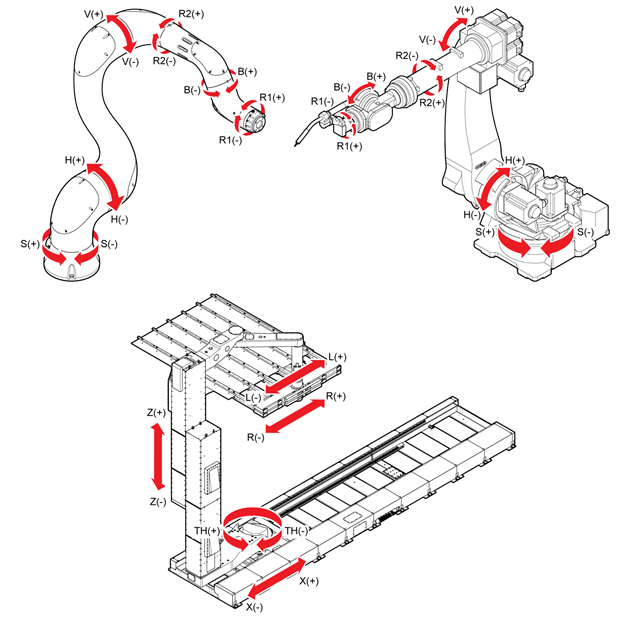

# 2.8.2 关节坐标系统

<table>
	<th style="background:lightgreen">关节坐标系统</th>
	<th>机器人坐标系统</th>
	<th>用户坐标系统</th>
	<th>工具坐标系统</th>
<tr>
	<td></td>
	<td></td>
	<td></td>
	<td></td>
</tr>
</table>

1.	在手动模式下打开电机，并按住教学挂件背面的启用开关。

2.	通过反复触摸 ${cont_model} 教学挂件屏幕状态显示窗口上的 `[Crd. Sys]` 按钮来选择关节坐标系统。然后，手动控制条将显示每个关节的名称。

    

    

3.	使用手动键操作机器人。机器人的每个关节独立移动。

    


有关机器人在手动键相对于的进展方向的详细信息，请参阅 "[2.8.1 手动键](./1-jog-key.md)"。
