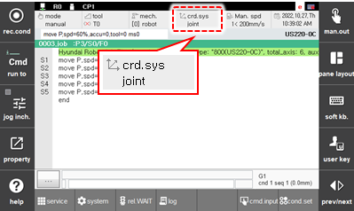
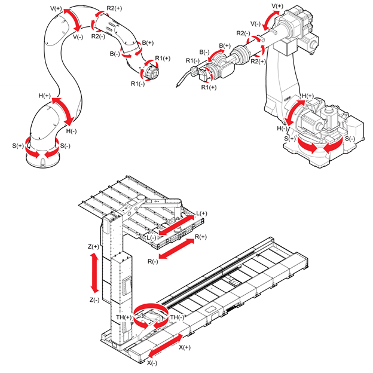

# 2.8.2 Joint Coordinate System

<table>
	<th style="background:lightgreen">Joint Coordinate System</th>
	<th>Robot Coordinate System </th>
	<th>User Coordinate System</th>
	<th>Tool Coordinate System</th>
<tr>
	<td></td>
	<td></td>
	<td></td>
	<td></td>
</tr>
</table>

1.	Turn on the motor in manual mode and hold the enabling switch on the back of the teach pendant.

2.	Select the joint coordinate system by repeatedly touching the \[Crd. Sys\] button on the status display window of the Hi6 teach pendant screen. Then, the jog bar will display the name of each joint.

    

    

3.	Operate the robot with the jog keys. Each joint of the robot moves independently.

    


For details on the robot’s progress direction in relation to the jog keys, refer to “[2.7.1 Jog Keys](jog-key.md)”. 


