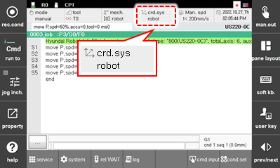
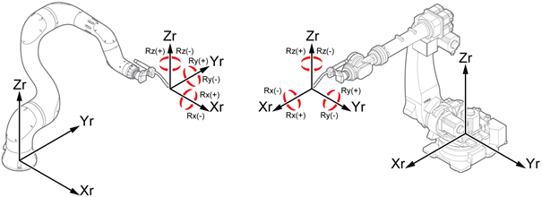
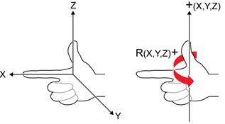

# 2.8.3 机器人坐标系统

<table>
	<th>关节坐标系统</th>
	<th style="background:lightgreen">机器人坐标系统</th>
	<th>用户坐标系统</th>
	<th>工具坐标系统</th>
<tr>
	<td></td>
	<td></td>
	<td></td>
	<td></td>
</tr>
</table>

1. 在手动模式下打开电机，并按住教学挂件背面的启用开关。

2. 通过反复触摸${cont_model}教学挂件屏幕状态显示窗口上的`[Crd. Sys]`按钮来选择机器人坐标系统。

    

    

3. 使用走动键操作机器人。机器人将如以下方式移动。

    


* 有关机器人相对于走动键的进程方向的详细信息，请参阅"[2.8.1 Jog Keys](1-jog-key.md)." 
* 
  如果使用右手，您可以轻松理解机器人坐标系统中的机器人操作。

   

图27 坐标系统方向 \(左\) / 旋转方向 \(右\)

* 如果您将右手食指的进程方向放在机器人坐标系统的X方向上，而站在机器人的背面，则拇指的进程方向变为Z方向，中指的进程方向变为Y方向。
* 如果您将右手的拇指放在旋转中心轴的方向上，则其他折叠手指的方向变为旋转方向的+方向。
