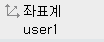
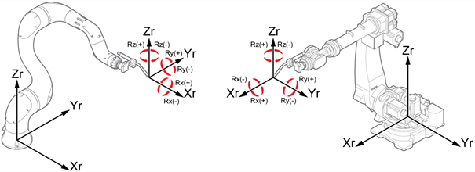

# 2.8.3 로봇 좌표계

<table>
	<th>축 좌표계</th>
	<th style="background:lightgreen">로봇 좌표계</th>
	<th>사용자 좌표계</th>
	<th>툴 좌표계</th>
<tr>
	<td></td>
	<td></td>
	<td></td>
	<td></td>
</tr>
</table>

1.	수동 모드에서 모터를 켜고 티치 펜던트 뒷면의 인에이블링 스위치를 잡으십시오.

2.	티치펜던트의 <**좌표계**> 키나 상태 표시줄의 [**좌표계**] 버튼을 반복해서 눌러, 로봇 좌표계를 선택하십시오.

3.	조그키로 로봇을 동작하십시오. 로봇이 다음과 같이 움직입니다.


* 조그키에 대한 로봇의 진행 방향에 대한 자세한 내용은 “[2.8.1 조그키](1-jog-key.md)”를 참조하십시오.
* 오른손을 이용하면 로봇 좌표계에서 로봇의 동작을 쉽게 이해할 수 있습니다.

 

그림 27 좌표계 방향\(좌\) / 회전 방향\(우\)

* 로봇 뒷면에서 오른손 검지 손가락의 진행 방향을 로봇 좌표계의 X방향으로 두면, 엄지 손가락의 진행 방향이 Z방향, 중지 손가락의 진행 방향이 Y방향이 됩니다.
* 오른손 엄지 손가락을 회전 중심축 방향으로 두면, 나머지 손가락을 접은 방향이 회전 방향의 + 방향입니다.


