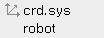
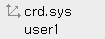
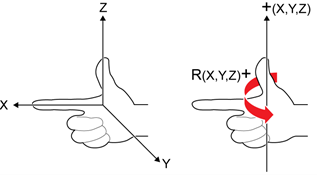

# 2.8.3 Robot Coordinate System

<table>
	<th>Joint Coordinate System</th>
	<th style="background:lightgreen">Robot Coordinate System</th>
	<th>User Coordinate System</th>
	<th>Tool Coordinate System</th>
<tr>
	<td></td>
	<td></td>
	<td></td>
	<td></td>
</tr>
</table>

1.	Turn on the motor in manual mode and hold the enabling switch on the back of the teach pendant.

2.	Select the robot coordinate system by repeatedly touching the \[Crd. Sys\] button on the status display window of the Hi6 teach pendant screen. 

    

    

3.	Operate the robot with the jog keys. The robot will move as follows.

    


* For details on the robot’s progress direction in relation to the jog keys, refer to “[2.7.1 Jog Keys](1-jog-key.md).” 
* 
  If you use your right hand, you can easily understand the operation of the robot in the robot coordinate system.

   

Figure 26 Coordinate System Direction \(Left\) / Rotation Direction \(Right\)

* If you put the progress direction of the right index finger in the X direction of the robot coordinate system, while you stand on the back of the robot, the progress direction of the thumb becomes the Z direction, and the progress direction of the middle finger becomes the Y direction.
* If you put the thumb of the right hand in the direction of the central axis of rotation, the direction of the other folded fingers becomes the + direction of the rotation direction.


