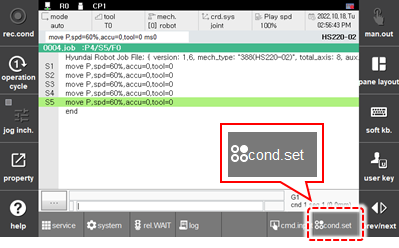
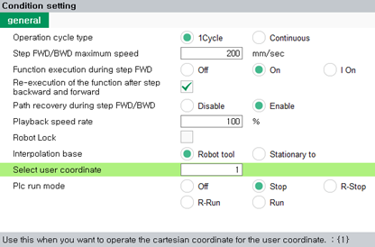
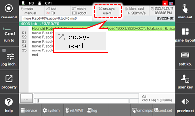
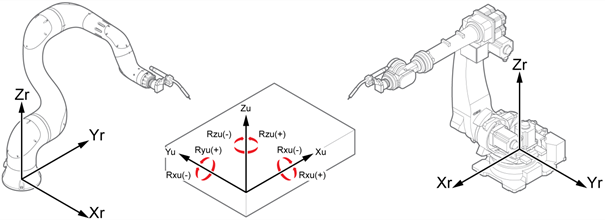

# 2.8.4 用户坐标系统

<table>
	<th>关节坐标系统</th>
	<th>机器人坐标系统</th>
	<th style="background:lightgreen">用户坐标系统</th>
	<th>工具坐标系统</th>
<tr>
	<td></td>
	<td></td>
	<td></td>
	<td></td>
</tr>
</table>

1.	在初始屏幕的右侧，触摸`[system]`按钮 - `[2: Control Parameter - 7: Coordinate System Registration - 1: User Coordinate System]`菜单，然后注册用户坐标系统。


有关如何注册用户坐标系统的详细信息，请参阅"[7.3.6.1 用户坐标系统](../../7-system/3-control-parameter/6-cordsys-reg/1-user-crdsys.md)。"


2.	在初始屏幕左下角触摸`[cond.set]`按钮，然后在`[9: Select user coordinate]`选项中设置坐标系统。您可以选择用户坐标系统，而不是笛卡尔坐标系统。

	

	

3.	在教学手柄上重复按下`[crd.sys]`键或在状态栏上按下坐标系统按钮以选择用户坐标系统。

	

	

4. 使用关节键操作机器人。机器人将如下移动。	

	


有关机器人与关节键的移动方向的详细信息，请参阅"[2.8.1 Jog Keys](1-jog-key.md)。" 
