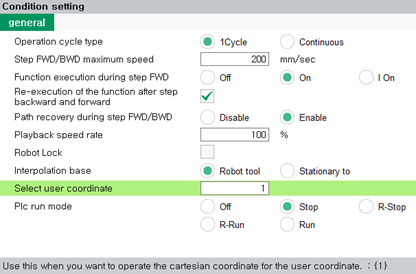

# 2.8.4 User Coordinate System

<table>
	<th>Joint Coordinate System</th>
	<th>Robot Coordinate System</th>
	<th style="background:lightgreen">User Coordinate System</th>
	<th>Tool Coordinate System</th>
<tr>
	<td></td>
	<td></td>
	<td></td>
	<td></td>
</tr>
</table>

1.	On the right side of the initial screen, touch the \[system\] button &gt; \[2: Control Parameter&gt; 7: Coordinate System Registration&gt; 1: User Coordinate System\] menu and then register the user coordinate system.


For details on how to register the user coordinate system, refer to “[7.3.6.1 User Coordinate System](../../7-system/3-control-parameter/6-cordsys-reg/1-user-crdsys.md).”


2.	Touch the \[Speed Adjustment\] button at the top left of the initial screen and then set the coordinate system in the \[9: Select user coordinate\] option. You can choose the user coordinate system instead of the Cartesian coordinate system.

	

	

3.	Operate the robot with the jog keys. The robot will move as follows.

	

	


For details on the robot’s progress direction in relation to the jog keys, refer to “[2.7.1 Jog Keys](1-jog-key.md).” 


