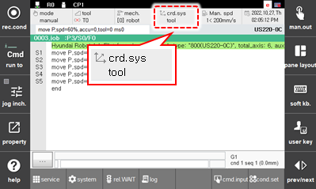
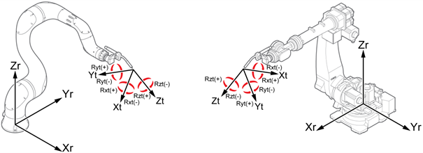
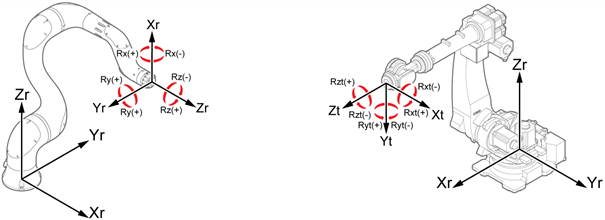

# 2.8.5 工具坐标系统

<table>
	<th>关节坐标系统</th>
	<th >机器人坐标系统</th>
	<th>用户坐标系统</th>
	<th style="background:lightgreen">工具坐标系统</th>
<tr>
	<td></td>
	<td></td>
	<td></td>
	<td></td>
</tr>
</table>

1.	以手动模式开启电机，同时按住教导控制器背面的启用开关。

2.	通过反复触碰 ${cont_model} 教导控制器屏幕状态显示窗口上的`[Crd. Sys]`按钮选择工具坐标系统。

    

    

3.	使用手动键操作机器人。机器人将如以下所示移动。

* 如果机器人上附加了焊接枪

    

* 如果机器人上没有附加焊接枪

    


有关机器人在与手动键相关的移动方向的详细信息，请参阅"[2.7.1 Jog Keys](1-jog-key.md)."
