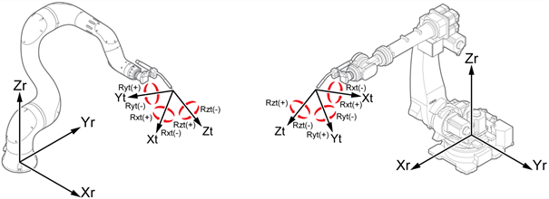
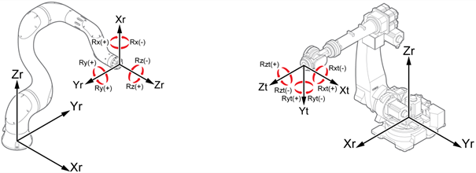

# 2.8.5 Tool Coordinate System

<table>
	<th>Joint Coordinate System</th>
	<th >Robot Coordinate System</th>
	<th>User Coordinate System</th>
	<th style="background:lightgreen">Tool Coordinate System</th>
<tr>
	<td></td>
	<td></td>
	<td></td>
	<td></td>
</tr>
</table>

1.	Turn on the motor in manual mode and hold the enabling switch on the back of the teach pendant.

2.	Select the tool coordinate system by repeatedly touching the \[Crd. Sys\] button on the status display window of the Hi6 teach pendant screen. 

    

    

3.	Operate the robot with the jog keys. The robot will move as follows.

* If a torch is attached to the robot

    

* If no torch is attached to the robot

    


For details on the robot’s progress direction in relation to the jog keys, refer to “[2.7.1 Jog Keys](1-jog-key.md).”


