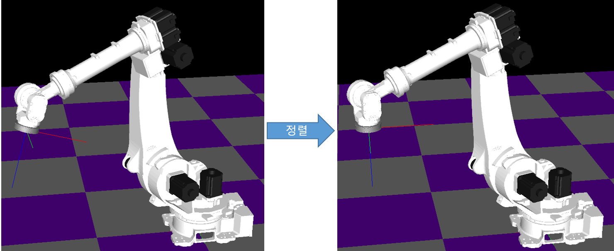
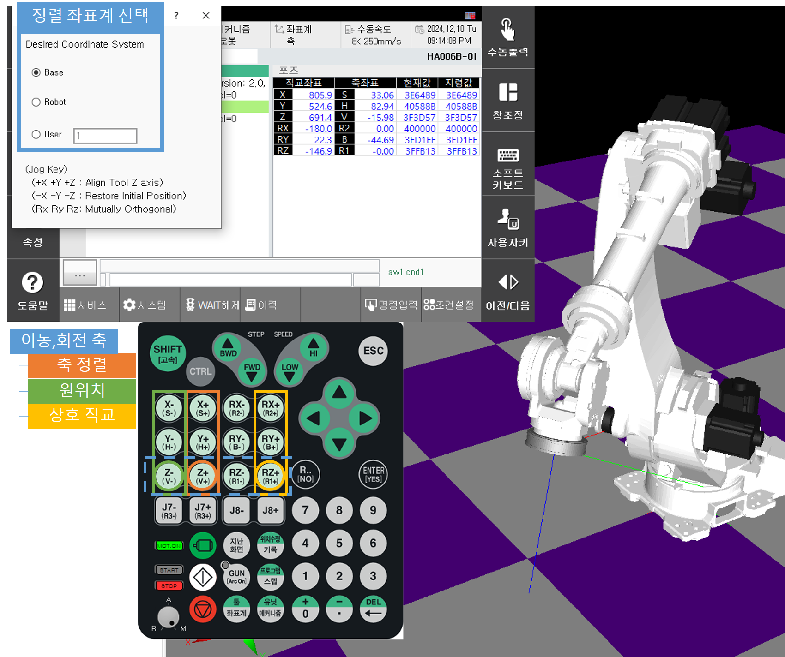

# 2.8.6 좌표축 정렬

설정한 좌표계의 축으로 TCP 좌표계를 정렬하는 기능입니다.

1.	목적에 맞는 위치로 로봇을 조그하십시오.

2.	티치펜던트의 <**Ctrl**> 버튼 키와 화면의 <**좌표계**>를 함께 누르거나, R300으로 좌표축 정렬 화면에 진입하십시오.

3.	이동하고자 하는 좌표계를 선택하십시오.

4.  원하는 축 방향으로 조그 키를 눌러 툴의 z축을 정렬하십시오.

5.  원하는 위치에 도달했으면 좌표축 정렬 화면을 ESC 키로 종료하십시오.

* 기타 기능
  - 원위치 복구 : -X, -Y, -Z 키
  - TCP 좌표계와 선택한 좌표계 상호 직교 : 툴의 z축 정렬 시 선택한 조그키의 회전 방향 키
     


* 좌표축 정렬 기능 창이 활성화 된 상태일 때는 조그 기능이 비활성화 된다.
* 상호 직교 기능은 툴의 z축이 선택한 좌표계의 축으로 정렬 완료 되었을때만 동작한다.
* 툴의 z축 정렬이 완료되면 조그버튼을 눌러도 해당위치에 있다.
* 소프트리밋을 피해갈 수 있는 방향으로 정렬을 진행하지만 그 어느 방향으로도 피할 수 없으면 소프트리밋 초과 에러 로그가 띄워진다.
  (예상되는 정렬 경로가 시계방향인데 소프트리밋이 발생하는 동작이면 시계반대방향으로 회전한다.)
* 베이스, 로봇, 사용자 좌표계 선택 후 조그하면 해당 좌표계로 기준이 변경된다.



* 반드시 로봇이 정지된 상태에서 수행해야하고 수동 모드일 때만 해당 기능을 실행하십시오.
* 정렬을 위해 조그 키를 누르는 도중 ESC 키를 눌러 팝업 창을 종료하면 바로 조그 기능이 적용되니 이에 유의하여 작업하십시오.
* 부가축이 베이스이고 X,Y,Z가 지정되지 않은 **임의** 상태이면 에러 로그가 띄워진다.
* 조그로도 이동할 수 없는 정렬 방향이면 도달할 수 없는 XYZ 위치입니다 에러 로그가 띄워진다.
* 보간 불가능 자세에서 정렬을 다시 진행하면 에러가 나오는데 이때 원위치 복구키를 눌러 해당 구간을 회피하여 움직이도록 한다.
* 특이점 발생 지점에서 정렬 할 때, 뗀 버튼을 다시 누르면 마저 이동하지만 현위치에서 경로를 재연산하므로 정상 속도로 동작한다.
  (속도가 조금 빨라지는데 해당 속도가 정상적인 속도)

