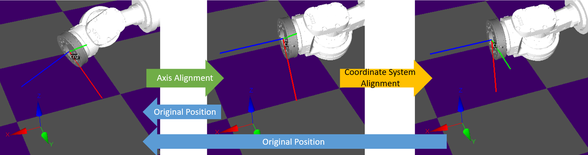
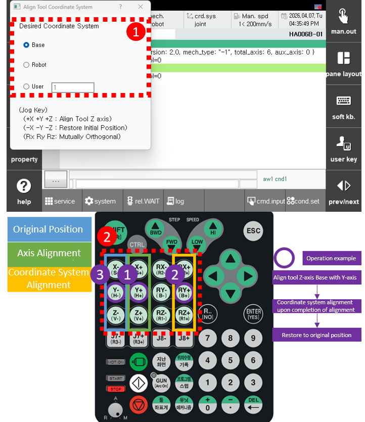

# 2.8.6 Coordinate Axis Alignment

This function aligns the TCP coordinate system with the axes of a selected coordinate system while keeping the XYZ position fixed.

The alignment is performed in two steps:
* Axis Alignment (Step 1) : In this step, the tool's Z-axis is aligned with the selected coordinate system.
* Coordinate System Alignment (Step 2) : After completing Axis Alignment (Step 1), the TCP coordinate system is adjusted to be orthogonal to the selected coordinate system.
* Return to Original Position : Moves the robot back to the initial position when entering this function. The return is performed regardless of whether the alignment steps are completed.

Procedure for Coordinate Axis Alignment
1.  After jogging to the desired position, ensure that:
    * The robot is stopped
    * The motor is ON
    * The system is in Manual Mode

2. Press the **`[Ctrl]`** button on the teach pendant together with `[crd.sys]`, or enter the coordinate axis alignment screen via R300.

3. Select the coordinate system you want to align to.

4. Press the jog key in the desired axis direction to align the tool's Z-axis. (Step 1)

5. After completing Axis Alignment (Step 1), press the rotational direction key corresponding to the previously selected axis to perform coordinate alignment. (Step 2 - optional)

6. Once the desired position is reached, press the `[ESC]` key to exit the coordinate axis alignment screen.

Jog Key Functions Summary
  - Axis Alignment: +X, +Y, +Z keys
  - Return to Original Position: -X, -Y, -Z keys
  - Coordinate Alignment: Rotational direction keys (+Rx, +Ry, +Rz) corresponding to the axis selected during Z-axis alignment


* Jog functions are disabled while the coordinate axis alignment window is active.
* Coordinate alignment is only available after completing axis alignment.
* Once the tool Z-axis alignment is completed, pressing jog buttons will maintain the current position.
* Alignment is performed in a direction that avoids soft limits. If no valid path exists, a soft limit exceeded error will be displayed. (If the expected path is clockwise but causes a soft limit, the system will rotate counterclockwise instead.)
* When Base, Robot, or User coordinate systems are selected, jogging will follow the selected coordinate system as the reference.



* This function must be performed only when the robot is stopped and in Manual Mode.
(It cannot be executed in Auto Mode.)
* If the `[ESC]` key is pressed while holding a jog key, the popup window will close and jog will be re-enabled. Use caution during operation.
* If the additional axis is set to Base and X, Y, Z are not defined (undefined state), an error log will be displayed.
* If the desired alignment direction is not reachable even with jogging, an error message indicating unreachable XYZ position will appear.
* If alignment is attempted again from a non-interpolatable posture, an error will occur. In this case, press the Return to Original Position key to avoid the problematic region and retry.
* When aligning at a singularity point, pressing the released button again will continue the motion. Since the path is recalculated from the current position, it operates at normal speed. (The speed increases slightly, but this is the normal speed.)

