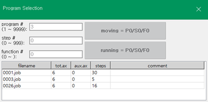
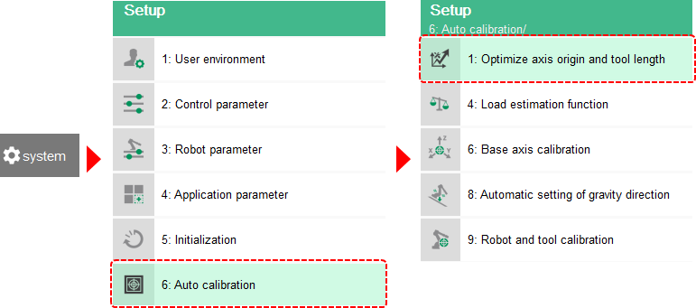
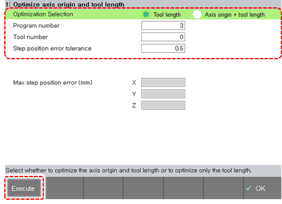

# 2.9 Optimization of the Axis Origin and Tool Length

You can make it possible for the axis integer and tool length to be automatically set to improve the accuracy of the linear interpolation trajectory and coordinate shifting.

* You can make it possible for the distance to the tooltip, which is difficult to measure in 3D, to be automatically set. The parameters to be calibrated are the axis origins of the H, V, R2, and B axes and the tool length in the X, Y, and Z directions.
* You can perform “optimization of axis origin and tool length” and of “tool length.”


You should optimize the “axis origin and tool length” before teaching the robot program. If the “axis origin and tool length” is optimized while a robot program has been created already, the position in the existing program may change.


The following shows how to set the optimization of the axis origin and tool length:

1.	Set the operation mode to manual mode using the mode switch on the teach pendant.

2.	After touching the <<b>PROG</b>> key with <<b>SHIFT</b>> in the JOB program window, input the program number, and then touch the \[OK\] button.

    

    

3.	Press the &lt;motor&gt; key on the teach pendant, and then the motor lamp will blink.

* If the motor is not turned on, check the error message on the log bar and resolve the trouble.

4.	Operate the robot using the jog key while holding the enabling switch on the back of the teach pendant.

5.	Place a pointed needle at an arbitrary location within the operation range of the robot, and then match the tooltip of the robot to it. The distance from the front end of the robot to the matched tooltip will be optimized.

6.	Record the step by touching the <**REC**> key of the keypad.

    

7.	Change the robot’s posture and repeat the above steps 5–6 more than four times.

* Change the robot’s posture using all six axes as much as possible. Moreover, change the axis angle by at least 30 degrees.

8.	Touch the \[system\] button &gt; \[6: Auto Calibration &gt; 1: Optimize axis origin and tool length\] menu.

    

9.	Set the program number, tool number, and step position error allowable range created for the automatic calibration, and then touch the \[Execute\] button. Then the selected axis origin and tool length will be set.

    

* When you use multiple tools, you should select Tool Length in the \[Optimization Selection\] option for the second tool. If you select Axis Origin and Tool Length, the previously set tool information will get incorrect.


For details on this function, refer to “[7.7.1 Optimization of Axis Origin and Tool Length](../7-system/7-auto-calibration/1-axis-origin-tool-length-optimization.md).”


