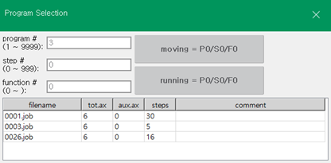
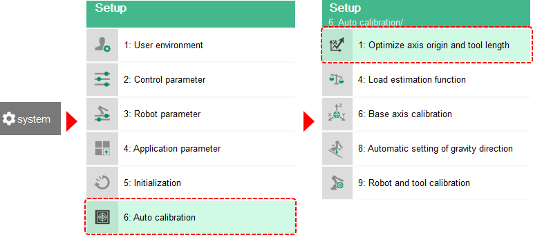
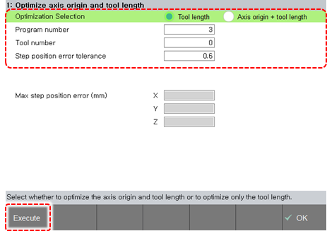

# 2.9 轴原点和工具长度的优化

您可以使轴整型和工具长度自动设置，从而提高线性插补轨迹和坐标偏移的准确性。

* 您可以使难以在 3D 中测量的工具提示到工具的距离自动设置。需要校准的参数是 H、V、R2 和 B 轴的轴原点以及 X、Y 和 Z 方向的工具长度。
* 您可以执行“轴原点和工具长度”的“优化”和“工具长度”。


* 从版本 V70.02-00 开始，轴原点优化功能将不再支持一般用户。如果您希望在后续版本中更改轴原点，请联系客户支持团队咨询专家或工程师。



您应该在教导机器人程序之前优化“轴原点和工具长度”。如果在已创建机器人程序时优化“轴原点和工具长度”，现有程序中的位置可能会改变。


以下显示了如何设置轴原点和工具长度的优化：

1. 使用教导盘上的模式开关将操作模式设置为手动模式。

2. 在 JOB 程序窗口中，按下 `[PROG]` 键和 `[SHIFT]`，输入程序编号，然后按下 `[Enter]` 按钮。

    

    

3. 按下教导盘上的 `[motor]` 键，电动机灯将闪烁。

* 如果电动机未开启，请检查日志栏上的错误信息并解决故障。

4. 在按住教导盘背面的使能开关的同时，使用 jog 键操作机器人。

5. 在机器人操作范围内的任意位置放置一个尖针，然后将机器人的工具提示与其对齐。机器人前端与匹配工具提示之间的距离将被优化。

6. 通过按下键盘上的 `[REC]` 键记录步骤。

    

7. 改变机器人的姿势，并重复步骤 5-6 超过四次。

* 尽量使用所有六个轴来改变机器人的姿势。此外，轴角度至少改变 30 度。

8. 按下 `[system]` 按钮 - `[6: Auto Calibration - 1: Optimize axis origin and tool length] ([6: Auto Calibration  - 1: Optimize axis origin and tool length])` 菜单。

    

9. 设置为自动校准而创建的程序编号、工具编号和步骤位置误差允许范围，然后按下 `[Execute]` 按钮。然后选定的轴原点和工具长度将被设置。

    

* 当您使用多个工具时，您应该在第二个工具的 `[Optimization Selection]` 选项中选择工具长度。如果选择轴原点和工具长度，先前设置的工具信息将会不正确。


有关此功能的详细信息，请参阅“[7.7.1 轴原点和工具长度的优化](../7-system/7-auto-calibration/1-axis-origin-tool-length-optimization.md)。”
