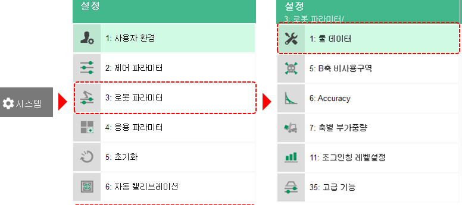
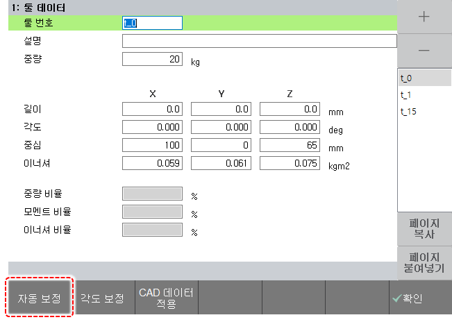

# 2.9 툴 데이터 자동 보정

자동 캘리브레이션 기능 등을 이용해 축 원점 및 툴 길이를 결정한 후 툴이 변형되었을 때 간단히 새로운 툴 데이터를 결정할 수 있습니다. 이때, 축 원점\(Axis origin\)은 결정되어 있어야 하고 계속 유지되어야 합니다. 또한 툴 길이를 결정하고 각도 보정을 완료한 후 고정된 기준점을 티칭해 두어야 합니다. 툴 변형이 발생하면 툴을 변경 전에 지정해 둔 기준점에 동일한 자세로 위치시킨 후 툴 데이터 자동 보정을 실행하십시오.

1.	\[시스템\] 버튼 &gt; \[3: 로봇 파라미터 &gt; 1: 툴 데이터\] 메뉴를 선택하십시오.

2.	\[자동보정\] 버튼을 터치한 후 조그키를 이용하여 툴 끝을 원래의 위치로 이동하십시오.

3.	미리 결정해 둔 기준점의 프로그램 번호, 스텝 번호, 설정할 툴 번호를 확인한 후 \[실행\] 버튼을 터치하십시오.


이 기능에 대한 자세한 내용은 “[7.4.1 툴 데이터](../setting/robot-parameter/tool-data/)”를 참조하십시오.


